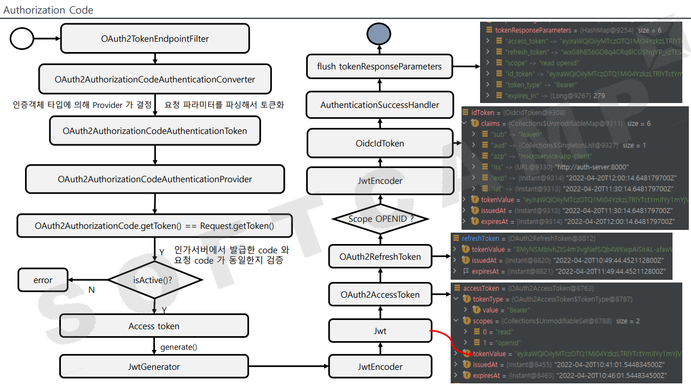

1. 클라이언트의 인증을 받음
2. 토큰 요청
3. **`OAuth2TokenEndpointFilter`** 가 요청을 가로 채서 처리
4. **`OAuth2AuthorizationCodeAuthenticationConverter`**  요청 파라미터를 파싱해서 토큰화 → 토큰화 한 값들을 **`OAuth2AuthorizationCodeAuthenticationToken`**, **`OAuth2AuthorizationCodeAuthenticationProvider`**을 거치며 실제 토큰 요청을 위한 준비
5. **`OAuth2AuthorizationCode.getToken() == Request.getToken()`**으로 인가 서버에서 발급한 code와 요청 code가 동일한지 검증
6. 이미 사용된 코드인지 판별
7. JWT Generator 클래스가 토큰을 실제로 만드는 역할
8. 내부에 JWTEncoder (토큰 검증 역할은 Decoder)
9. **`OAuth2AccessToken`** 객체에 토큰 생성
10. scope에 openId 항목이 포함되어 있으면, 인가 서버는 별도의 OpenId 커넥터를 통해 idToken을 생성하고 **`AuthenticationSuccessHandler`** , **`flsuh tokenResponseParameteres`**를 통해 **`HashMap`** 으로 토큰을 담아 클라이언트에게 응답

### Successful Response

- access_token(필수) - 권한 부여 서버에서 발급한 액세스 토큰 문자열
- token_type(필수) - 토큰 유형은 일반적으로 **"Bearer"** 문자열
- expires_in(권장) – 토큰의 만료시간
- refresh_token(선택 사항) - 액세스 토큰이 만료되면 응용 프로그램이 다른 액세스 토큰을 얻는 데 사용할 수 있는 Refresh 토큰을 반환하는 것이 유용
  하다.
  단, implicit 권한 부여로 발행된 토큰은 새로고침 토큰을 발행할 수 없다.
- scope(선택 사항) - 사용자가 부여한 범위가 앱이 요청한 범위와 동일한 경우 이 매개변수는 선택사항, 사용자가 부여한 범위가 요청된 범위와 다른 경우 이 매개변수가 필요함

```json
HTTP/1.1 200 OK
Content-Type: application/json
Cache-Control: no-store // 액세스 토큰으로 응답할 때 서버는 클라이언트가 이 요청을 캐시하지 않도록 HTTP 헤더에 포함해야 함

{
	"access_token":"MTQ0NjJkZmQ5OTM2NDE1ZTZjNGZmZjI3",
	"token_type":"Bearer",
	"expires_in":3600,
	"refresh_token":"IwOGYzYTlmM2YxOTQ5MGE3YmNmMDFkNTVk",
	"scope":"create"
}
```

### Unsuccessful Response

- invalid_request - 요청에 매개변수가 누락, 지원되지 않는 매개변수, 매개변수 반복되는 경우 서버가 요청을 진행할 수 없음
- invalid_client - 요청에 잘못된 클라이언트 ID 또는 암호가 포함된 경우 클라이언트 인증에 실패, HTTP 401 응답
- invalid_grant - 인증 코드가 유효하지 않거나 만료됨
  권한 부여에 제공된 리다이렉션 URL이 액세스 토큰 요청에 제공된 URL과 일치하지 않는 경우 반환하는 오류
- invalid_scope - 범위를 포함하는 액세스 토큰 요청의 경우 이 오류는 요청의 유효하지 않은 범위 값을 나타냄
- unauthorized_client - 이 클라이언트는 요청된 권한 부여 유형을 사용할 권한이 없음(RegisteredClient 에 정의하지 않은 권한 부여 유형을 요청한 경우)
- unsupported_grant_type - 권한 부여 서버가 인식하지 못하는 승인 유형을 요청하는 경우 이 코드를 사용함

```json
HTTP/1.1 400 Bad Request
Content-Type: application/json
Cache-Control: no-store
{
	"error": "invalid_request",
	"error_description": "Request was missing the 'redirect_uri' parameter.",
	"error_uri": "See the full API docs at https://authorization-server.com/docs/access_token"
}
```