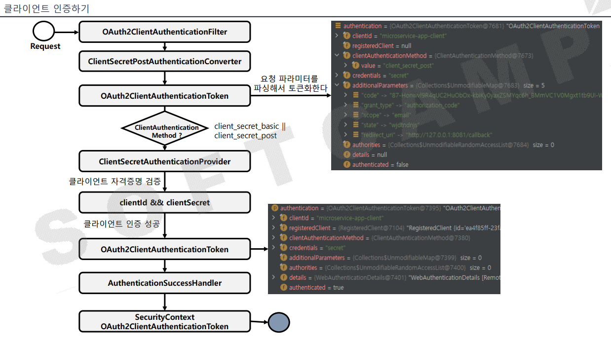

## Token Endpoint - 클라이언트 인증
### **OAuth2ClientAuthenticationConfiguer**

- OAuth2 클라이언트 인증을 위한 사용자 정의하는 기능을 제공한다.
- 클라이언트 인증 요청에 대한 전처리, 기본 처리 및 후처리 로직을 커스텀하게 구현할 수 있도록 API를 지원한다.
- Oauth2ClientAuthenticationFilter를 구성하고 이를 OAuth2 인증 서버 SecurityFilterChain 빈에 등록한다.
- 지원되는 클라이언트 인증 방법은 **`client_secret_basic`**, **`client_secret_post`**, **`private_key`**, **`client_Secret_jwt`** 및 **`none`** (공개 클라이언트)이다.

### **Oauth2ClientAuthenticationFilter**

- 클라이언트 인증 요청을 처리하는 필터이며 다음과 같은 기본 값으로 구성된다.
- **DelegatingAuthenticationConverter**
    - ClientsecretBasicAuthenticationConverter - 클라이언트 요청 방식이 HTTP Basic일 경우 처리
    - ClientSecretPostAuthenticationConverter - 클라이언트 요청 방식이 POST일 경우 처리
    - JwtClientAssertionsAuthenticationConverter - 클라이언트 요청 방식이 JWT 토큰일 경우 처리
    - PubliClientAuthenticationConverter - 클라이언트 요청 방식이 PKCE일 경우 처리
- **DelegatingAuthenticationProvider**
    - *ClientSecretAuthenticationProvider*, JwtClientAssertionAuthenticationProvider, PublicClientAuthenticationProvider
    - 권한 부여 유형에 따라 토큰을 발행하는 AuthenticationProvider 구현체이다.
- AuthenticationSuccessHandler - 인증된 OAuth2ClientAuthenticationToken 에 SecurityContext 를 연결하는 내부 구현체
- AuthenticationFailureHandler - 인증된 OAuth2AuthenticationException를 사용하여 OAuth2 오류 응답을 반환하는 내부 구현체

### **RequestMatcher**

- 토큰 요청 패턴
    - **POST /oauth/token, POST /oauth/introspect, POST /oauth2/revoke**

