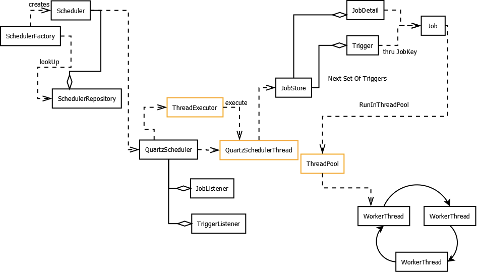

### **전체 흐름 요약**
1. **Scheduler 인스턴스 생성**
   * SchedulerFactory가 Scheduler를 생성하고 SchedulerRepository에 등록
2. **Job과 Trigger 등록**
   * JobDetail과 Trigger는 JobStore에 저장해 Scheduler에 등록
3. **Trigger 확인 및 실행**
   * QuartzSchedulerThread는 JobStore에 트리거된 작업이 있는지 확인하고, 트리거가 실행 가능한 경우 이를 ThreadPool로 전달
4. **작업 실행**
   * ThreadPool의 WorkerThread는 할당된 Job을 실행하며, 실행 중인 작업과 트리거의 상태는 JobListener와 TriggerListener에 의해 감지될 수 있음

### **주요 속성**
- **Scheduler**
  - Job과 Trigger를 연결하고 Job을 실행시키는 역할
- **Job**
  - 실제로 수행할 작업을 정의하는 인터페이스로, 각 Job은 execute(JobExecutionContext context) 메서드를 통해 트리거될 때 실행할 로직을 가지고 있음
- **JobDetail**
  - 실행할 작업의 정의
  - 어떤 작업을 할 것인지에 대한 모든 정보가 포함
    - Job의 인스턴스에 대한 구성을 나타내는 객체로, 작업의 이름, 그룹, 추가 데이터, 재시작 여부와 같은 속성을 포함
- **Trigger**
  - 언제 Job을 실행할지 결정하는 역할
  - 하나의 Job에 여러 개의 Trigger를 설정 가능

**즉, Scheduler는 Job과 Trigger를 연결하여 Job을 실행하는 역할을 하며, Job은 실제 작업 로직을 담고, JobDetail은 작업의 구성과 정보를 정의하며, Trigger는 Job의 실행 시점을 결정한다.**

### 주요 옵션
- **isDurable**
  - JobDetail의 isDurable이 true이면 Job에 Trigger가 존재하지 않아도 JobDetail 삭제 x
  - JobDetail의 isDurable이 false이면 Job에 Trigger가 존재하지 않으면 JobDetail 삭제
- **requestRecovery**
  - Job 실행 중 장애 발생 시 재실행 요청 여부
- **MisFire**
  - Quartz 스케줄러에서 트리거(작업 스케줄)가 설정된 시간에 실행되지 못한 상황
  - **MisFire 기준: misfireThreshold**에 따라 결정 (디트 값 5초)
    - **misfireThreshold**가 10초이고,**오전 10시**에 실행될 예정인 트리거가 존재
    - 만약 트리거가**오전 10시 10초 이전에 실행되지 않았다면**, Quartz는 다음 실행 시간이**오전 10시 이전**이므로 이를 미스파이어로 간주
    - 미스파이어 여부 체크는 30초에 한 번 (QuartzSchedulerThread의 idleWaitTime 디폴트 값이 30초)
    - misfireThreshold는 yml 파일에서 변경 가능하지만  idleWaitTime은 코드 레벨에서 변경해야함
  - 그 후, 트리거에 설정된**정책**에 따라 Quartz가 해당 트리거를 처리
  - **정책**
    - **FireAndProceed**: 미스파이어가 발생하면 즉시 작업을 실행한 후 다음 주기 스케줄을 유지
    - **IgnoreMisfires**: 미스파이어를 인식하고, 다음 주기 스케줄로 넘어감
    - **DoNothing**: 미스파이어를 인 하지 않고, 다음 스케줄까지 대기

### **주의점**

- 기본적으로 JobName, TriggerName은 중복되면 안 되지만, JobGroup과 TriggerGroup이 다른 경우 중복 허용
- cronExpression이 특정 날인 경우 해당 주기에 스케줄 작업 후 Quartz 내부적으로 자동 삭제
  - ex) 2024-11-07 오전 9시에 Job이 등록된 경우 해당 시간에 Job 실행 후 해당 Trigger (ex) 2024-11-07 오전 9시) 삭제
    - Quartz는 실행 가능성이 없는 Trigger는 등록시키지 않음, 만약 처음 서버 기동할 때 실행 가능성이 없는 Trigger를 등록하려는 경우 에러 발생