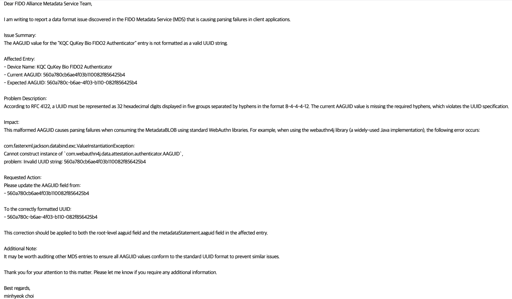
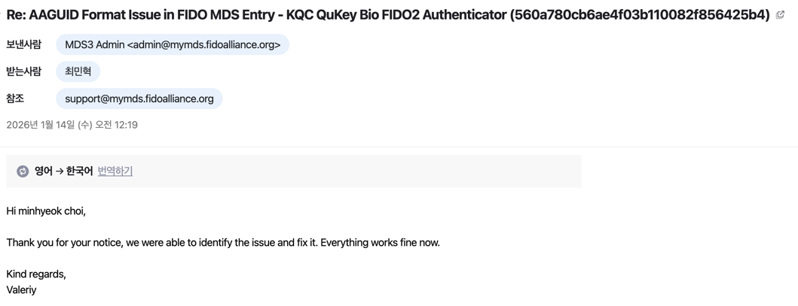

### 개요

WebAuthn(FIDO2) 인증을 다루다 보면 사용자가 등록한 인증장치(보안키·패스키 등)가 "어떤 모델인지" 식별해야 할 때가 있다. 이때 쓰는 값이 AAGUID(Authenticator Attestation GUID)로, 인증장치 모델마다 부여된 128비트 식별자다. 다만 AAGUID 자체는 식별자일 뿐이라 어떤 제조사의 어떤 모델인지 알려면 별도의 메타데이터가 필요하고, 그 메타데이터를 제공하는 곳이 FIDO Alliance가 운영하는 MDS(Metadata Service)다.

진행 중이던 프로젝트에서는 서비스 기동 시점에 FIDO MDS(`https://mds3.fidoalliance.org/`)에서 메타데이터 BLOB을 받아와 AAGUID → 디바이스명 매핑을 구성하고, 이를 등록된 인증장치의 모델명 표시와 특정 모델 차단 정책에 활용하고 있었다. MDS BLOB은 JWS로 서명된 하나의 큰 문서이고, webauthn4j(`webauthn4j-metadata 0.25.1`)로 파싱한다.

---

### 문제 상황

MDS 연동을 붙이고 서비스를 기동하자, 메타데이터를 로드하는 단계에서 파싱 예외가 발생했다.

```
com.fasterxml.jackson.databind.exc.ValueInstantiationException:
Cannot construct instance of `com.webauthn4j.data.attestation.authenticator.AAGUID`,
problem: Invalid UUID string: 560a780cb6ae4f03b110082f856425b4
```

webauthn4j는 BLOB 안의 각 엔트리를 역직렬화하면서 `aaguid` 필드를 `AAGUID` 타입으로 변환하는데, 내부적으로 `UUID.fromString()`을 사용한다. 그런데 문제가 된 값 `560a780cb6ae4f03b110082f856425b4`는 하이픈이 전혀 없는 32자리 16진수였다.

[RFC 4122](https://datatracker.ietf.org/doc/html/rfc4122)에 따르면 UUID는 32자리 16진수를 `8-4-4-4-12` 형태로 하이픈으로 구분해 표기해야 한다. 즉 올바른 값은 다음과 같아야 했다.

```
560a780cb6ae4f03b110082f856425b4        ← MDS가 내려준 값 (하이픈 없음, 규격 위반)
560a780c-b6ae-4f03-b110-082f856425b4    ← RFC 4122 기준 올바른 값
```

`UUID.fromString()`은 하이픈이 없는 문자열을 받으면 `IllegalArgumentException("Invalid UUID string")`을 던진다. 결국 우리 코드의 문제가 아니라, MDS가 내려주는 데이터셋 자체에 규격을 어긴 값이 섞여 있던 것이다. 해당 엔트리를 추적해보니 `KQC QuKey Bio FIDO2 Authenticator`라는 인증장치였다.

한 가지 더 문제가 되는 점은, MDS BLOB 파싱이 엔트리 단위가 아니라 문서 전체 단위로 이뤄진다는 것이다. 수백 개 엔트리 중 단 하나라도 규격을 어긴 값이 있으면 그 지점에서 역직렬화가 실패하면서 BLOB 전체 로드가 중단된다. 메타데이터 한 건 때문에 전체 매핑을 만들지 못하는 셈이다.

---

### 해결

우리 서비스 쪽에서 해당 예외를 잡아 넘기는 식으로 우회할 수도 있었지만, 근본 원인은 명백히 MDS 데이터의 규격 위반이었다. 같은 BLOB을 쓰는 다른 RP(Relying Party)들도 똑같이 겪을 문제라고 판단해 FIDO Alliance MDS 팀에 직접 문의했다.

문의에는 문제가 된 엔트리와 현재/기대 AAGUID 값, RFC 4122 위반이라는 근거, webauthn4j 같은 표준 라이브러리에서 파싱이 실패한다는 재현 가능한 에러를 함께 정리해 전달했다.



또한 다른 엔트리에도 같은 포맷 문제가 없는지 점검을 제안했다.

회신 결과 문제를 확인했고 수정했다는 답을 받았으며, 이후 서비스도 정상적으로 MDS 메타데이터를 로드할 수 있었다.


