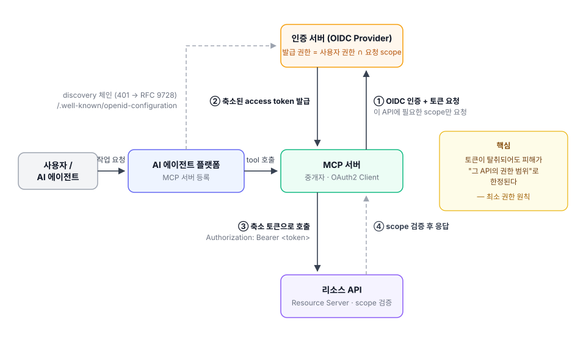
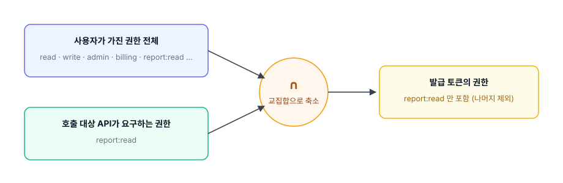

### 개요

AI 에이전트가 MCP(Model Context Protocol)를 통해 서비스의 API를 직접 호출하는 구조가 빠르게 표준이 되고 있다. 우리 팀도 자체 구축한 MCP 서버를 통해 내부 API를 에이전트에게 열어주는 아키텍처를 준비하면서, 인증 서버에 OpenID Connect(OIDC) Provider를 도입하는 설계에 참여했다.

설계에서 가장 오래 붙잡고 있었던 질문은 "에이전트를 어떻게 인증할 것인가"가 아니었다. 인증은 표준을 따라가면 된다. 진짜 문제는 그다음이었다.

> 인증된 에이전트에게, 어떤 권한의 토큰을 줄 것인가?

이 글은 그 질문에 대한 답으로 정리한 최소 권한 토큰 축소(Scope Downscoping) 설계를 다룬다.

---

### 문제: 중개자가 들고 다니는 토큰이 너무 크다

MCP 서버는 에이전트의 요청을 받아 우리 API를 대신 호출하는 중개자다. 일반적인 OAuth2 흐름대로라면 MCP 서버는 사용자를 대신해 발급받은 access token을 들고 API를 호출하는데, 이 토큰에는 보통 사용자가 가진 권한 전체가 담긴다.

사람이 쓰는 콘솔이라면 크게 문제되지 않을 수 있다. 그런데 토큰을 들고 다니는 주체가 에이전트라면 이야기가 달라진다. 설계 과정에서 정리한 우려는 세 가지였다.

첫째, **탈취 반경**. 토큰이 유출되면 그 API 하나가 아니라 사용자 권한 전부가 노출된다.

둘째, **과잉 권한**. 에이전트는 프롬프트 인젝션 등으로 의도가 오염될 수 있어, "실수로 권한 밖 리소스를 건드리는" 시나리오가 사람보다 훨씬 현실적이다.

셋째, **감사의 어려움**. 사고가 났을 때 이 도구가 무엇을 할 수 있었는지 토큰만 봐서는 답할 수 없다.

그래서 목표를 한 문장으로 정했다.

> "사용자가 가진 권한 전체"를 담은 넓은 토큰이 아니라, **지금 호출하려는 그 API가 요구하는 권한만** 담은 토큰을 발급한다. — 최소 권한 원칙(Least Privilege)

---

### 전체 아키텍처



| 구성 요소 | 역할 |
|---|---|
| 사용자 / AI 에이전트 | 에이전트 플랫폼을 통해 "어떤 작업"을 요청하는 주체 |
| AI 에이전트 플랫폼 | 에이전트가 사용할 MCP 서버를 등록해 두는 서비스 |
| MCP 서버 | 에이전트의 tool 호출을 받아 API를 대신 호출하는 중개자 (OAuth2 Client) |
| 인증 서버 (OIDC Provider) | OIDC 인증 + 토큰 발급 주체. 권한 축소가 일어나는 곳 |
| 리소스 API | 보호된 실제 API. 토큰의 scope를 검증하고 응답 |

흐름은 네 단계다. MCP 서버가 토큰을 요청할 때 사용자 권한 전체가 아니라 이번에 호출할 API에 필요한 scope만 요청하고(①), 인증 서버는 "사용자가 실제로 가진 권한 ∩ 요청 scope"로 좁혀서 발급한다(②). MCP 서버는 그 축소된 토큰으로 API를 호출하고(③), API는 서명과 scope를 검증한 뒤 응답한다(④).

여기서 짚고 갈 것이 하나 있다. 이 그림 어디에도 "인증 서버 주소를 입력하는 곳"이 없다. 에이전트 쪽에 등록하는 것은 MCP 서버 주소 하나뿐이고, 인증 서버의 위치와 엔드포인트는 전부 표준 체인으로 발견된다.

1. 에이전트가 토큰 없이 MCP 서버를 호출하면, MCP 서버는 401과 함께 `WWW-Authenticate` 헤더로 자신의 리소스 메타데이터 위치를 알려준다.
2. 에이전트가 MCP 서버의 `/.well-known/oauth-protected-resource`(RFC 9728)를 조회하면, 응답의 `authorization_servers` 필드에 인증 서버 위치가 들어 있다.
3. 에이전트는 그 인증 서버의 `/.well-known/openid-configuration`을 조회해 authorize·token 엔드포인트와 지원 기능을 알아낸다.
4. 이후는 일반적인 OAuth 2.1 흐름이다. PKCE로 인가 코드를 받고 토큰으로 교환한다.

"MCP 서버 → 인증 서버 → 엔드포인트"로 이어지는 발견이 전부 `/.well-known` 표준으로 연결되어 있어서, 에이전트는 사전 설정 없이도 처음 보는 인증 서버와 인증 흐름을 시작할 수 있다.

> **참고 — 에이전트는 어떻게 401을 보고 따라갈 줄 아는가**
>
> HTTP에서 401 + `WWW-Authenticate`는 원래 "인증하면 다시 올 수 있다"는 도전장(challenge)이다(RFC 9110). 여기에 MCP 스펙이 요구 수준을 못 박아 뒀다 — 서버는 401 응답의 이 헤더에 리소스 메타데이터 위치를 담아야 하고(MUST), 클라이언트는 이 헤더를 파싱해 대응해야 한다(MUST). 여기서 MUST는 RFC 2119가 정의한 요구 키워드로, 구현이 반드시 따라야 하는 절대 요구사항을 뜻한다. 스펙을 준수하는 클라이언트라면 401을 받는 순간 이 발견 절차가 코드로 돌아간다.

OIDC를 선택한 이유도 이 체인 안에 있다. [MCP 공식 스펙](https://modelcontextprotocol.io/specification/2025-06-18/basic/authorization)은 인증 서버에 OAuth 2.1 구현과 표준 discovery 제공을 요구하고(discovery는 RFC 8414 또는 OpenID Connect Discovery — 클라이언트는 둘 다 지원해야 한다), Claude나 Cursor 같은 MCP 클라이언트들이 이 표준을 전제로 동작한다. 표준을 따르면 특정 클라이언트에 맞춘 커스텀 연동을 만들 필요가 없어진다.

---

### 권한 축소가 일어나는 지점

핵심은 토큰 발급 시점이다. 발급되는 토큰의 권한을 두 값의 교집합으로 좁힌다.



| | 축소 없을 때 | 축소 적용 시 |
|---|---|---|
| 토큰에 담기는 권한 | 사용자 권한 전체 | 그 API가 요구하는 최소 권한만 |
| 탈취 시 피해 범위 | 사용자 권한 전부 | 그 API 범위로 한정 |
| 감사 가독성 | 토큰만 봐서는 불명확 | 토큰 = 도구의 권한 명세 |

표의 오른쪽 열이 되면 토큰이 곧 "이 도구가 할 수 있는 일의 명세서"가 된다. 사고 조사가 단순해지는 부수 효과도 있다.

---

### 구현 방식 두 가지

권한을 언제 어떻게 자르느냐를 두고 두 가지 방식을 비교했다.

**(A) 발급 시점 scope 축소.** MCP 서버가 처음부터 `scope=report:read`처럼 필요한 scope만 지정해서 요청하고, 인증 서버가 교집합으로 좁혀 발급하는 방식이다. 추가 grant type 없이 기존 발급 흐름의 연장선에서 갈 수 있다는 것이 장점이다. 다만 전제가 있다 — 토큰이 scope 기반으로 권한을 거를 수 있는 구조여야 한다. 기존 토큰이 "사용자 권한 전체를 클레임에 담는" 구조라면 발급 로직 수정이 먼저다.

**(B) RFC 8693 Token Exchange.** 일단 사용자 토큰을 받은 뒤, 특정 API(audience)를 대상으로 좁힌 토큰으로 교환받는 방식이다.

```
POST /token
grant_type=urn:ietf:params:oauth:grant-type:token-exchange
subject_token=<넓은 사용자 토큰>
audience=<호출 대상 API>
scope=report:read
```

audience별로 토큰을 분리·축소하는 표준의 정석이고, 한 세션에서 여러 API를 호출할 때 API마다 다른 축소 토큰을 쓸 수 있다. 대신 신규 grant type 구현이 필요하다.

결론적으로 둘 중 하나를 고르는 문제가 아니었다. **(A)로 시작해서 audience 분리가 필요해지는 시점에 (B)로 확장**하는 로드맵을 제안했고, audience 표현은 RFC 8707(Resource Indicators)의 `resource` 파라미터를 쓰기로 했다.

---

### 설계하면서 부딪힌 결정들

그림은 단순하지만, 설계 문서를 쓰다 보니 답을 정해야 하는 지점이 계속 나왔다. 비슷한 설계를 하게 될 사람을 위해 다섯 가지를 남겨둔다.

**축소 단위 — scope인가, 역할인가.** 기존 토큰이 역할(authorities) 중심으로 권한을 표현하고 있다면, "API가 요구하는 scope"와 "사용자가 가진 역할"은 단위가 달라 교집합을 바로 계산할 수 없다. 역할→scope 매핑 카탈로그를 먼저 정의해서 두 축을 정렬하는 작업이 선행 과제였다.

**"API가 필요로 하는 권한"은 누가 선언하는가.** API 쪽 메타데이터로 선언할 수도 있고, 인증 서버의 클라이언트 설정으로 둘 수도 있다. 전자는 API가 자기 요구사항의 단일 출처가 되는 대신 인증 서버가 그것을 조회할 경로가 필요하고, 후자는 검증이 인증 서버 안에서 닫히는 대신 API 변경과 설정이 어긋날 수 있다. 정답이 있다기보다 운영 주체가 누구냐에 따라 갈리는 문제였다.

**신원 scope는 축소 대상에서 제외한다.** 축소 로직이 OIDC 신원 scope(`openid`/`profile`/`email`)까지 잘라버리면 id_token이 발급되지 않아 로그인 자체가 깨진다. "축소는 기능 권한 scope에만 적용하고 신원 scope는 항상 보존한다"를 규칙으로 명시하지 않으면, 이후 누군가 축소 로직을 수정하다가 로그인 장애로 이어지기 쉽다.

**축소는 단일 집행점에서.** 요청 시점 검증, 발급 시점 축소, audience 부착이 코드 여러 곳에 흩어지면 우회 변종이 생긴다. 예를 들어 인가 요청에는 resource를 생략하고 토큰 요청에만 붙이는 식이다. 흩어진 게이트 사이의 틈은 생각보다 빨리 발견된다. 어떤 경로로 들어와도 토큰 발급 직전 한 곳에서 최종 재바운딩하는 구조가 안전하다.

**fail-closed가 기본값.** 사용자의 역할 정보를 해석하지 못했을 때 "축소 없이 통과"시키는 순간, 그 예외 경로가 곧 우회 경로가 된다. 못 읽으면 좁게 발급하거나 거부하는 쪽이 맞다.

---

### 마무리

에이전트가 API를 호출하는 시대의 IdP는 "누구인가"(인증)만큼 "무엇까지 할 수 있는가"(인가의 범위)를 정밀하게 다뤄야 한다. 한 문장으로 줄이면 — **중개자에게는 지금 필요한 만큼의 토큰만 준다.**

그리고 그것을 특정 벤더의 방식이 아니라 OIDC Discovery, RFC 8693, RFC 8707 같은 표준 위에서 조립하면 MCP 생태계의 어떤 클라이언트와도 호환되는 구조가 된다.
