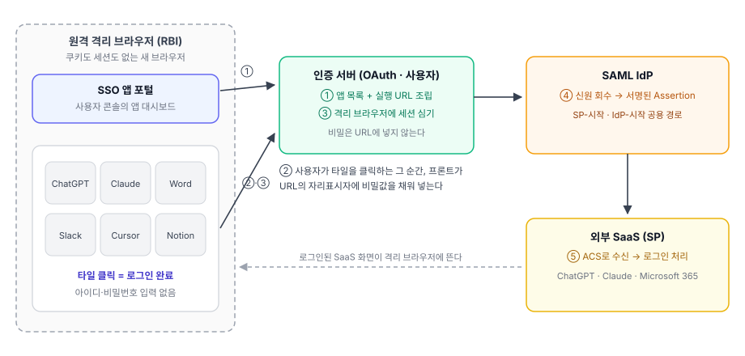
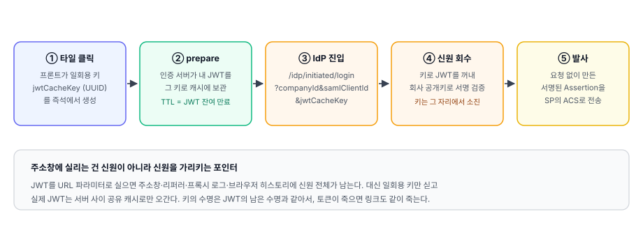
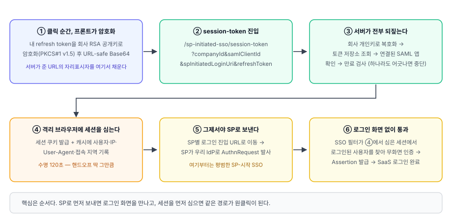
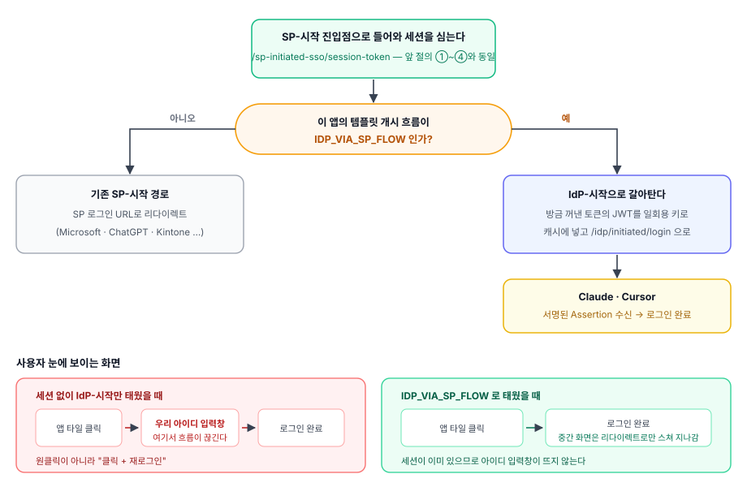

*SP-Initiated · IdP-Initiated, 그리고 그 사이에 하나 더*

---

### 개요

원격 격리 브라우저(RBI, Remote Browser Isolation)는 사용자의 PC 대신 **격리된 원격 브라우저**로 웹을 열어 주는 보안 방식이다. 악성 스크립트가 사내 단말까지 내려오지 못하게 하는 게 목적이라, 그 브라우저는 매번 아무것도 남아 있지 않은 상태에서 시작한다. 쿠키도 없고, 세션도 없고, 어제 로그인한 기록도 없다.

이 "깨끗함"이 SSO 와 정면으로 부딪힌다. 사용자는 이미 우리 포털에 로그인해서 앱 목록을 보고 있는데, 그가 열게 될 격리 브라우저 안에서는 아무도 그를 모른다. ChatGPT 아이콘을 눌러도 SaaS 는 "누구세요"라고 묻고, 그 물음에 답하려면 다시 아이디와 비밀번호를 입력해야 한다. 격리를 켠 대가로 로그인을 두 번 하는 셈이다.

내가 맡은 일은 이 지점이었다. **격리 브라우저의 앱 타일을 한 번 누르면, 그 SaaS 에 이미 로그인된 화면이 떠 있을 것.** 정리하면 질문은 하나로 좁혀진다.

> 이미 인증된 사용자의 신원을, 아무것도 없는 브라우저 안으로 어떻게 옮겨 심을 것인가?

답은 하나가 아니었다. SaaS 마다 받아 주는 방식이 달라서 결국 세 갈래 흐름이 생겼고, 그중 하나는 표준 문서 어디에도 없는, SP 를 하나씩 붙여 보다가 만들어진 흐름이다.

---

### 전체 그림

| 구성 요소 | 역할 |
|---|---|
| SSO 앱 포털 | 격리 브라우저 안에서 사용자가 보는 앱 타일 대시보드 |
| 인증 서버 | 앱 목록과 실행 URL을 조립하고, 격리 브라우저에 세션을 심는 주체 |
| SAML IdP | 사용자 신원을 서명된 SAML Assertion으로 만들어 SP로 발사 |
| 외부 SaaS (SP) | Assertion을 받아 자기 서비스에 로그인 처리 |

흐름은 두 박자다. 먼저 포털이 **앱 목록**을 받아 타일을 그리고(①), 사용자가 타일을 누르는 순간 그 타일에 들어 있던 URL로 이동한다(②·③). 그 URL이 인증 서버를 거쳐 SAML IdP까지 이어지고, IdP가 서명된 Assertion을 SaaS로 쏘면(④·⑤) 로그인이 끝나 있다.

여기서 미리 짚어 둘 게 하나 있다. **인증 서버가 응답하는 URL에는 비밀값이 하나도 들어 있지 않다.** 목록 응답은 캐시에도 남고 로그에도 남는 흔한 GET 응답이라, 거기에 재사용 가능한 자격증명을 넣는 순간 그건 목록이 아니라 유출 경로가 된다. 그래서 서버는 비밀이 들어갈 자리에 **자리표시자**만 박아 둔 껍데기 URL을 주고, 실제 값은 사용자가 타일을 클릭하는 그 순간 프론트가 메모리에서 채운다.

---

### 앱 목록 API — 목록이 아니라 "실행 URL"을 준다

`GET /{companyId}/saml/sso-apps` 하나가 포털이 쓰는 유일한 목록 API다. 이 API의 성격은 조회보다 조립에 가깝다. 앱마다 이름·로고와 함께 **그 앱을 열기 위해 눌러야 할 완성된 URL**을 만들어 내려 준다.

왜 프론트가 아니라 서버가 조립하냐면, URL 모양을 결정하는 정보가 전부 서버 쪽에 있기 때문이다. 이 앱이 어떤 개시 흐름을 지원하는지, SP의 로그인 진입 주소가 무엇인지, 어느 SAML 앱 설정과 묶여 있는지는 템플릿과 테넌트 설정에 흩어져 있다. 프론트가 이걸 알아야 한다면 SaaS를 하나 추가할 때마다 프론트도 같이 배포해야 한다. 지금 구조에서는 **템플릿에 개시 흐름 값 하나를 적으면 URL 모양이 바뀌고, 프론트는 그대로다.**

조립 규칙은 개시 흐름에 따라 갈린다.

| 템플릿의 개시 흐름 | 조립되는 URL |
|---|---|
| `IDP_INITIATED` / `BOTH` | SAML IdP의 IdP-시작 진입점 (`/idp/initiated/login`) |
| `SP_INITIATED` | 인증 서버의 세션 심기 진입점 (`/sp-initiated-sso/session-token`) → SP 로그인 주소 |
| `IDP_VIA_SP_FLOW` | 세션 심기 진입점으로 들어가되, 그 안에서 IdP-시작으로 전환 |

그리고 비밀이 들어갈 자리는 이렇게 비워 둔다.

| 자리표시자 | 클릭 순간 프론트가 채우는 값 |
|---|---|
| `@JWT_CACHE_KEY@` | 프론트가 즉석에서 만든 UUID (신원을 가리킬 일회용 키) |
| `@ENCRYPTED_USER_REFRESH_TOKEN@` | 회사 RSA 공개키로 암호화한 본인 refresh token |
| `@PADDING_TYPE@` | 위 암호화에 쓴 패딩 방식 |

프론트 입장에서는 규칙이 단순해진다 — URL에 자리표시자가 있으면 채워 넣고 열고, 없으면 그냥 연다.

**한 앱이 여러 타일이 되기도 한다.** Microsoft 365는 SAML 앱 하나로 Word·Excel·PowerPoint·OneDrive·Outlook·SharePoint·Teams가 전부 묶여 있는데, 사용자는 "Microsoft"가 아니라 "Word"를 누르고 싶어 한다. 그래서 서버가 하위 앱마다 도착지가 다른 URL을 따로 조립해 내려주고, 포털은 그걸 개별 타일로 펼친다. 이때 하위 앱 이름은 템플릿 고정값("SharePoint")이라 같은 템플릿을 두 테넌트로 등록하면 타일이 구분되지 않는다. 이름 옆에 도메인을 붙이는 대신 별도 필드로 내려 준 이유는 모바일 2열 타일에서 이름이 두 줄을 다 먹으면 병기한 도메인이 통째로 잘리기 때문이다.

**앱 하나가 대시보드 전체를 죽이지 않게 했다.** 목록 조립은 앱마다 템플릿 조회·URL 생성이 얽혀 있어서 설정이 덜 된 앱 하나로도 예외가 난다. 조립을 앱 단위로 감싸서, 실패한 앱은 로그만 남기고 목록에서 빼고 나머지는 정상적으로 그린다. 대시보드는 "전부 아니면 전무"가 되면 안 되는 화면이다.

**권한은 한 칸 열고, 대신 한 칸 잠갔다.** 이 API는 관리자용이 아니라 일반 사용자 포털이 쓰는 API라 `USER` 권한까지 열어야 했다. 다만 우리 테넌트 검증은 기본이 감사(로그만 남김) 모드라, 그대로 열면 남의 테넌트 앱 목록(URL·서브앱·로고)이 노출될 여지가 생긴다. 그래서 이 엔드포인트에는 전역 설정과 무관하게 **본인 테넌트 또는 마스터만** 통과시키는 하드 차단을 별도로 걸었다.

---

### 흐름 A — IdP-시작: 신원을 캐시에 잠깐 맡긴다

Slack·Notion·Salesforce처럼 IdP가 먼저 말을 걸어도 받아 주는 SaaS는 가장 단순한 경로를 탄다.

핵심은 ②와 ③ 사이다. IdP-시작 진입점은 브라우저 로그인 세션을 요구하지 않는다(요구할 수가 없다 — 격리 브라우저에는 세션이 없다). 대신 **요청에 실린 키가 가리키는 JWT 자체가 인증 수단**이 된다. 그래서 그 링크가 곧 신원이고, 링크를 다루는 방식이 이 흐름의 보안 전부다.

그래서 URL에 JWT를 그대로 싣지 않았다. 토큰을 주소창에 실으면 브라우저 히스토리·리퍼러 헤더·중간 프록시 로그에 신원이 통째로 남는다. URL에 실리는 건 **값이 아니라 포인터**여야 한다. 프론트가 UUID를 하나 만들어 그 키로 신원을 서버 캐시에 맡기고(prepare), 링크에는 키만 싣는다. IdP는 그 키로 신원을 꺼내 서명을 검증한 뒤 Assertion을 만든다.

키의 수명도 따로 정하지 않고 **JWT의 남은 만료 시간을 그대로 TTL로 썼다.** 토큰이 죽으면 링크도 같이 죽는다. 여기서 한 가지 방어를 더 넣었는데, 이미 만료된 토큰이면 TTL이 0 이하로 계산된다. 이 값을 그대로 캐시에 넣으면 저장소에 따라 "만료 없음"으로 해석될 수 있어서, 만료된 토큰은 캐시에 넣기 전에 거절한다.

IdP 쪽에서 만들어지는 Assertion은 SP-시작과 딱 두 가지가 다르다. 대응하는 요청이 없으므로 `InResponseTo`가 비고(unsolicited), SP가 지정할 RelayState가 없으므로 템플릿 값으로 채운다. NameID 산출·속성 매핑·서명 규칙은 SP-시작과 **완전히 같은 코드 경로**를 탄다. 신원의 출처만 다르고 그 뒤는 같게 둔 덕분에, 이 흐름을 얹으면서 기존 SSO 로직은 건드리지 않았다.

---

### 흐름 B — SP-시작: 순서를 뒤집는 것이 전부

Microsoft 365·Kintone·ChatGPT처럼 **SP가 먼저 말을 걸어야 하는** SaaS는 사정이 다르다. 이 앱들은 사용자를 자기 로그인 진입 주소로 보내면 SP가 우리 IdP로 인증 요청(AuthnRequest)을 발사한다. 문제는 그 요청이 도착하는 순간이다. 요청을 받은 우리 IdP는 "이 브라우저에 로그인한 사람이 누구지?"를 확인하는데, 격리 브라우저에는 세션이 없으니 답은 늘 "모름"이고, 결과는 우리 로그인 화면이다.

고친 건 로직이 아니라 **순서**다. SP로 보내기 전에, 격리 브라우저에 우리 세션을 먼저 심는다.

세션을 심으려면 "이 브라우저를 여는 사람이 정말 그 사용자"라는 증거가 필요한데, 그 증거로 **본인의 refresh token**을 썼다. 이미 발급되어 서버 저장소에 존재하고, 서버가 소유자·만료·연결된 클라이언트를 전부 되짚을 수 있는 값이기 때문이다. 다만 이 값은 그대로 URL에 실을 수 없어서, 프론트가 **회사 RSA 공개키로 암호화**한 뒤 URL-safe Base64로 바꿔 싣는다. 복호화 키는 서버만 가지고 있으므로 링크를 가로챈 쪽은 아무것도 할 수 없다.

서버는 받은 값을 하나도 믿지 않고 전부 되짚는다 — 회사가 실재하는지, 그 회사 개인키로 복호화가 되는지, 복호화한 토큰이 저장소에 있는지, 만료되지 않았는지, 그리고 이 SAML 앱에 연결된 OAuth 클라이언트가 실제로 존재하는지. 하나라도 어긋나면 세션을 심지 않는다.

심는 세션에는 사용자 아이디와 함께 **접속 IP·User-Agent·접속 지역**을 같이 기록한다. 이후 SSO 필터가 이 세션으로 무화면 인증을 할 때 User-Agent 일치를 확인한다. IP는 일부러 비교에서 뺐는데, NAT 뒤에서 나가는 대표 IP가 한 개가 아닐 수 있어서 정상 사용자를 튕겨 내기 때문이다. 세션 수명은 **120초**로 뒀다. 이 세션의 용도는 로그인 상태 유지가 아니라 핸드오프 한 번이라, 딱 그 왕복에 필요한 만큼만 살아 있으면 된다.

**SP마다 "로그인 진입 주소"의 정체가 다르다.** 이게 문서로는 안 나오는 부분이라 하나씩 붙여 보며 확인했고, 결국 SP별 전략 구현체로 분리했다.

| SP | 진입 주소로 쓰는 값 |
|---|---|
| ChatGPT · Perplexity | 테넌트별 SP 로그인 URL |
| Microsoft | SP의 Assertion 수신 주소(ACS) |
| Kintone | SP entityId |

새 SaaS를 붙일 때 이 인터페이스 구현체를 하나 추가하면 팩토리가 템플릿 이름으로 알아서 골라 쓴다. 조건 분기를 늘리는 대신 파일을 하나 늘리는 쪽을 택했다.

---

### 흐름 C — IDP_VIA_SP_FLOW: 어느 쪽에도 안 맞는 SP를 위해

Claude와 Cursor에서 위의 두 흐름이 둘 다 어긋났다.

이 앱들은 분류상 IdP-시작이라 A를 태우는 게 맞다. 그런데 실제로 격리 브라우저에서 IdP-시작 링크로 곧장 보내 보면, 중간에 **우리 아이디 입력 화면**이 끼어들었다. 사용자 입장에서는 원클릭이 아니라 "클릭하고 다시 로그인"이다. B로 태우자니 이 앱들에는 우리가 붙잡고 시작할 SP-시작 진입점이 없다.

그래서 두 흐름을 섞었다. **껍데기는 SP-시작, 알맹이는 IdP-시작이다.**

타일 URL은 흐름 B와 같은 세션 심기 진입점을 가리킨다. 그 진입점에서 세션을 심는 데까지는 완전히 동일하고, **SP로 리다이렉트하기 직전에 갈림길**을 하나 둔다. 이 앱의 템플릿 개시 흐름이 `IDP_VIA_SP_FLOW`면, 방금 저장소에서 꺼낸 그 토큰의 JWT를 일회용 키로 캐시에 넣고 IdP-시작 진입점으로 보낸다. 즉 흐름 A의 prepare를 **프론트 대신 서버가, 이미 검증이 끝난 신원으로** 대신 해 주는 셈이다.

효과는 두 가지다. 첫째, IdP-시작 SSO가 그대로 돌아간다. 둘째, 그 과정에서 우리 아이디 입력 화면이 뜰 이유가 사라진다 — 이미 앞 단계에서 세션을 심었기 때문에, 인증을 요구받는 지점이 있어도 화면 없이 통과한다. 사용자 눈에는 클릭 한 번에 Claude가 열린 것으로 보인다.

**왜 기존 값으로 못 쓰고 개시 흐름 값을 하나 더 만들었나.** 기존 값들은 이미 "URL을 어느 진입점으로 조립할지"를 결정하는 좌표로 쓰이고 있었다. `BOTH`는 "IdP-시작 링크로 조립하라"로 해석되고, `SP_INITIATED`는 "SP 주소로 보내라"로 해석된다. 이 앱들에 필요한 건 **"SP-시작 진입점으로 조립하되, 그 안에서 IdP-시작으로 갈아타라"** 는 제3의 좌표였다. 기존 값에 예외 조건을 덧대면 조립부와 실행부 두 곳에서 같은 예외를 각각 알고 있어야 하고, 둘 중 하나만 고치는 순간 조용히 깨진다. 값 하나를 늘리는 쪽이 훨씬 싸게 먹혔다.

**이 값은 스펙이 아니라 실측 결과다.** SaaS의 SSO 문서는 대체로 "SP-initiated와 IdP-initiated를 지원합니다" 수준에서 끝나고, 실제로 붙여 보면 SP-시작이라면서 IdP-시작만 받거나, IdP-시작인데 중간에 자기 로그인 화면으로 한 번 튕기는 경우가 흔했다. 그래서 템플릿의 개시 흐름 필드는 문서를 옮겨 적은 값이 아니라, 앱을 하나하나 등록하고 실제로 로그인시켜 보며 확인한 결과를 적어 둔 필드다. 지금 붙어 있는 SaaS 기준으로 `IDP_VIA_SP_FLOW`가 필요했던 건 Claude와 Cursor 둘이었다.

**테스트 경로도 같이 만들었다.** SaaS 수십 개를 다 확인하려면 계정마다 로그인해 볼 수는 없어서, 관리자가 **특정 사용자로 SSO를 대신 태워 보는** 진입점을 뒀다. 지정한 사용자의 토큰을 만들어 캐시에 넣고, IdP-시작에 필요한 키와 SP-시작에 필요한 refresh token을 한 번에 돌려준다. 다만 이건 사실상 대리 로그인이라 관리자 권한으로 제한하고, 운영 프로파일에서는 아예 없는 엔드포인트(404)로 응답하게 막아 뒀다.

---

### 세 흐름 비교

| | 흐름 A (IdP-시작) | 흐름 B (SP-시작) | 흐름 C (IDP_VIA_SP) |
|---|---|---|---|
| 진입점 | IdP-시작 링크 | 세션 심기 링크 | 세션 심기 링크 |
| 격리 브라우저에 세션 | 심지 않음 | 심음 (120초) | 심음 (120초) |
| 신원 전달 수단 | 일회용 키 → 캐시의 JWT | 암호화된 refresh token | 둘 다 (앞은 토큰, 뒤는 키) |
| SSO 개시 주체 | 우리 IdP | 외부 SP | 우리 IdP |
| 대표 SaaS | Slack · Notion · Salesforce | Microsoft 365 · Kintone · ChatGPT | Claude · Cursor |

---

### 만들면서 정한 것들

**비밀은 서버가 URL에 넣지 않는다.** 목록 응답은 캐시·로그·모니터링에 남는 평범한 GET 응답이다. 서버는 자리표시자만 박은 껍데기를 주고, 프론트가 클릭 순간 메모리의 값으로 채운다. 대신 이 계약은 문서가 아니라 코드 양쪽(조립부·치환부)에 자리표시자 상수로 못 박아 뒀다. 문자열 하나가 어긋나면 링크가 조용히 깨지는 종류의 계약이라, 어긋났을 때 바로 눈에 띄는 곳에 두는 게 중요했다.

**심는 세션은 짧게.** 이 세션의 목적은 로그인 유지가 아니라 핸드오프 한 번이다. 120초는 SP를 한 바퀴 돌고 오기에는 넉넉하고, 링크가 유출됐을 때 재사용하기에는 짧다. 이 값을 길게 잡고 싶은 유혹이 계속 생기는데(디버깅할 때 특히), 길게 잡는 순간 이 흐름의 보안 근거가 사라진다.

**세션 도용은 User-Agent로 막고, IP로는 막지 않는다.** IP 고정은 그럴듯하지만 NAT 뒤에서는 대표 IP가 여러 개라 정상 사용자를 튕겨 낸다. 보안 장치는 우회 난이도만큼이나 **정상 사용자를 얼마나 튕기느냐**로 평가해야 한다는 걸 여기서 배웠다.

**한 앱의 설정 오류가 대시보드를 죽이지 않게.** 목록 조립을 앱 단위로 감싸고, 실패는 로그로 남기고 그 앱만 뺀다. 사용자에게는 "앱이 하나 안 보임"이고, 운영자에게는 "이 앱 설정이 잘못됨"이다. 둘 다 대시보드가 통째로 안 뜨는 것보다 낫다.

**원클릭의 절반은 팝업 차단과의 싸움이었다.** 이 흐름들은 클릭 후에 서버 왕복(prepare, 공개키 조회)이 끼기 때문에, 그 응답을 기다렸다가 새 창을 열면 브라우저가 "사용자 제스처가 아닌 창 열기"로 보고 차단한다. 그래서 클릭 스택에서 **빈 창을 먼저 열고**, 비동기 작업이 끝나면 그 창의 주소만 바꾼다. 실패하면 열어 둔 빈 창을 닫는 것까지 처리해야 사용자가 빈 탭을 떠안지 않는다.

**SaaS 연동은 문서를 믿지 말고 붙여 볼 것.** 이번 작업에서 가장 시간을 많이 쓴 부분이자, 결과적으로 세 번째 흐름이 태어난 이유다. 개시 흐름 값은 스펙의 복사가 아니라 실측의 기록이어야 한다.

---

### 마무리

RBI 환경의 SSO는 결국 **"신원을 어떻게 옮겨 심느냐"** 의 문제였고, 옮기는 방법은 SaaS가 무엇을 받아 주느냐에 따라 달라졌다. IdP가 먼저 말을 걸 수 있으면 신원을 일회용 키로 넘겼고, SP가 먼저 말을 걸어야 하면 그 대화가 시작되기 전에 세션을 먼저 심었다. 그리고 둘 중 어느 쪽도 그대로는 맞지 않는 SaaS를 위해, 앞은 SP-시작 뒤는 IdP-시작인 흐름을 하나 더 만들었다.

한 문장으로 줄이면 — **격리 브라우저에는 비밀을 보내지 말고, 비밀을 쓸 자격을 서버가 대신 확인한 뒤 그 결과만 심는다.**
