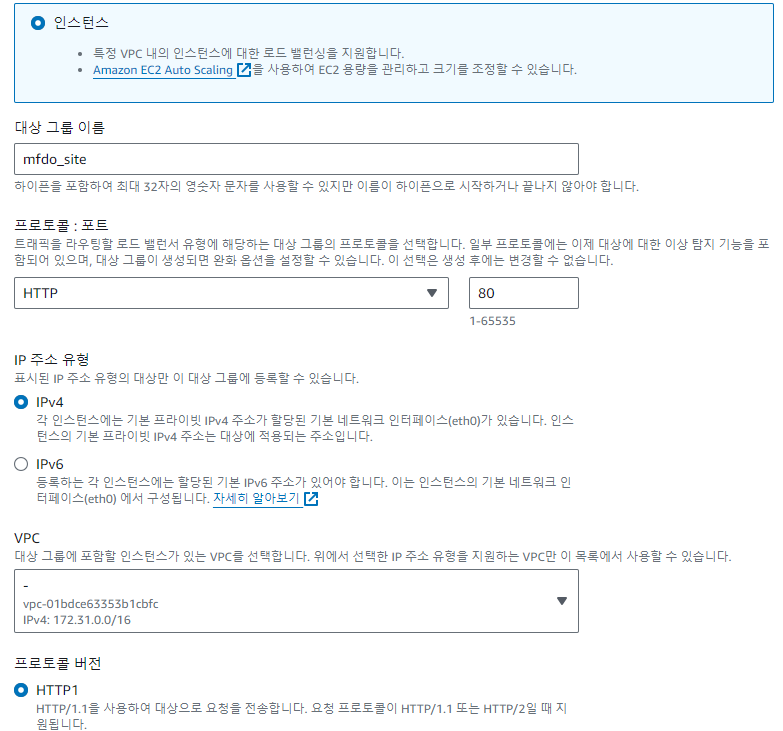
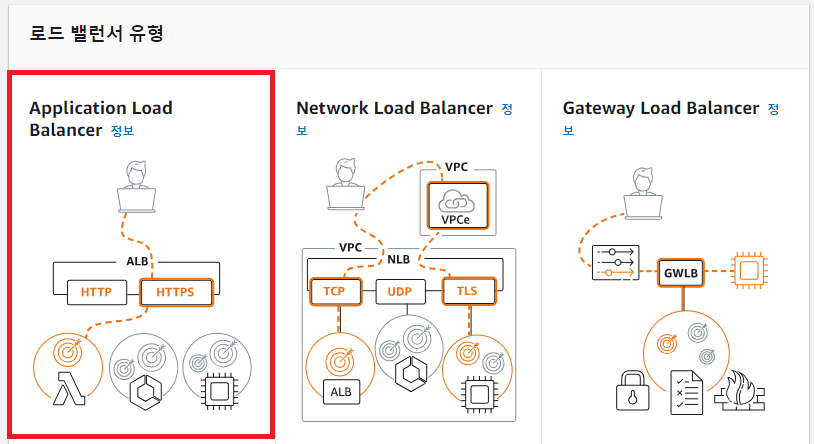
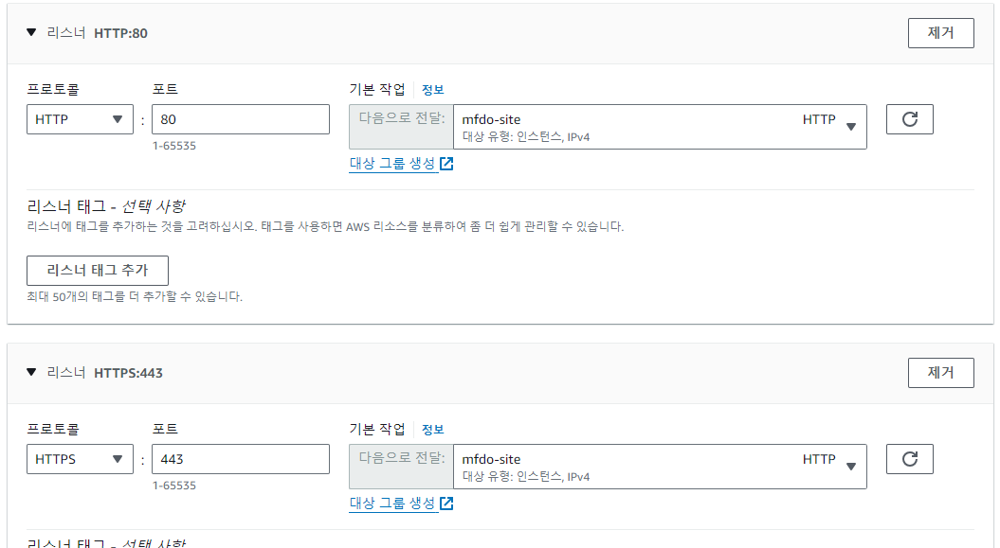
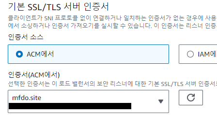
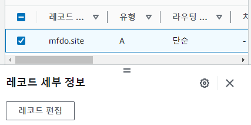

### HTTPS 적용
EC2 인스턴스와 도메인 구매 작업, 적용은 선행되어야 한다.

1. **인증서 발급**
* 완전히 정규화된 앞서 도메인 이름에는 구매한 도메인 명을 입력하면 상태가 검증 대기 중에서 -> 성공으로 바뀐다.
  * 만약 도메인이 `a.co.kr`인데, 인스턴스에 적용된 도메인이 `www.a.co.kr`이라면 `*.a.co.kr`로 작성한다.
* 성공으로 바뀌면 Route 53에서 레코드를 생성한다.

- - -

2. **타겟 그룹 생성**

- - -

3. **로드 밸런서 생성**
* 네트워크 매핑 중 가용 영역은 ec2와 동일하게 맞춰야 한다.
* 보안 그룹에서 443(https), 80(web) 포트 규칙을 설정해야한다.

- - -

4. **A 레코드 수정**  
* 별칭을 적용해 앞서 생성한 로드 밸런서를 선택한다.  

