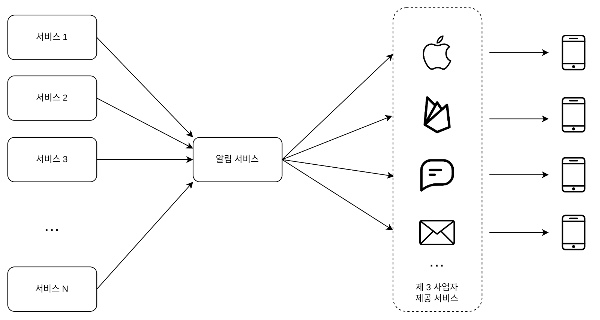

### 알림 시스템 설계

* 알림 시스템은 단순히 모바일 푸시 알림에 한정되지 않는다.
* 알림 시스템은 모바일 푸시 알림, SMS 메시지, 이메일 세 가지로 분류할 수 있다.

**문제 이해 및 설계 범위 확정**

* 하루에 백만 건 이상의 알림을 처리하는 확장성 높은 시스템을 구축하는 게 쉬운 과제는 아니다.
* 알림 시스템이 어떻게 구현되는지에 대한 깊은 이해가 필요하고, 면접에 출제될 때는 문제 자체가 모호하게 주어지므로 적절한 질문을 통해 알아내야 한다.
    * 요구 사항
        * 푸시 알림, SMS 메세지, 이메일을 지원해야한다.
        * 연성 실시간 시스템이고 높은 부하가 걸렸을 때 약간의 지연은 무방하다.
        * iOS 단말, 안드로이드 단말, 랩톱/데스크톱을 지원 해야한다.
        * 클라이언트 애플리케이션 프로그램이 알림을 만들 수 있고, 서버 측에서 스케줄링 할 수도 있다.
        * 사용자가 알림을 받지 않도록 설정할 수도 있어야 한다.
        * 하루에 천만 건의 모바일 푸시 알림, 백만 건의 SMS 메시지, 5백만 건의 이메일을 보낼 수 있어야 한다.

---

### 개략적 설계안 제시 및 동의 구하기

**iOS 푸시 알림**
* 알림 제공자: 알림 요청을 만들어 애플 푸시 알림 서비스(APNS: Apple Push Notification Service)로 보내는 주체다.
* 알림 요청을 만들려면 다음과 같은 데이터가 필요하다.
    * 단말 토큰: 알림 요청을 보내는 데 필요한 고유 식별자다.
    * 페이로드: 알림 내용을 담은 JSON 딕셔너리다. 아래는 그 예다.
```json
{
   "aps":{
      "alert":{
         "title":"Game Request",
         "body":"Bob wants to play chess",
         "action-loc-key":"PLAY"
      },
      "badge"5
   }
}
```
* APNS: 애플이 제공하는 원격 서비스다. 푸시 알림을 iOS 장치로 보내는 역할을 담당한다.
* iOS 단말: 푸시 알림을 수신하는 사용자 단말이다.

**안드로이드 푸시 알림**
* 안드로이드 푸시 알림도 비슷한 절차로 전송된다. APNS 대신 FCM(Firebase Cloud Messaging)을 사용한다는 점만 다르다.

**SMS 메시지**
* SMS 메시지를 보낼 때는 보통 트윌리오, 넥스모같은 제 3사업자의 서비스를 많이 이용한다. 이런 서비스는 대부분 상용 서비스라서 이용요금을 내야한다.

**이메일**
* 대부분의 회사는 고유 이메일 서버를 구축할 역량은 갖추고 있다.
* 그럼에도 많은 회사가 상용 이메일 서비스를 이용한다. 그중 유명한 서비스로 센드그리드, 메일침프가 있다. 전송 성공률도 높고, 데이터 분석 서비스도 제공한다.

**연락처 정보 수집 절차**
* 알림을 보내려면 모바일 단말 토큰, 전화번호, 이메일 주소 등의 정보가 필요하다.
* 사용자가 앱을 설치하거나 처음으로 계정을 등록하면 API 서버는 해당 사용자의 정보를 수집해 데이터베이스에 저장한다.
* 이메일 주소와 전화번호는 user 테이블에 저장하고, 단말 토큰은 device 테이블에 저장한다. 한 사용자가 여러 단말을 가질 수 있고, 알림은 모든 단말에 전송되어야 한다는 점을 고려했다.


**개략적 설계안 (초안)**
* 1부터 N까지의 서비스
  * 이 서비스 각각은 마이크로서비스 일 수도 있고, 크론잡일 수도 있고, 분산 시스템 컴포넌트일 수도 있다.
  * 사용자에게 납기일을 알리고자 하는 과금 서비스, 배송 알림을 보내려는 쇼핑몰 웹사이트 등이 그 예다.
* 알림 시스템
  * 알림 시스템은 알림 전송/수신 처리의 핵심이다.
  * 우선은 1개 서버만 사용하는 시스템이라고 가정해 보자.
  * 이 시스템은 서비스 1~N에 알림 전송을 위한 API를 제공해야 하고, 제3자 서비스에 전달할 알림 페이로드를 만들어 낼 수 있어야 한다.
* 제3자 서비스
  * 이 서비스들은 사용자에게 알림을 실제로 전달하는 역할을 한다.
  * 제3자 서비스와의 통합을 진행할 때 유의할 것은 확장성이다.
  * 또 하나 고려해야 할 것은, 어떤 서비스는 다른 시장에서는 사용할 수 없다. 가령 FCM은 중국에서 사용할 수 없다. 중국은 제이푸시, 푸시와이 같은 서비스를 사용해야 한다.
* iOS, 안드로이드, SMS, 이메일 단말
  * 사용자는 자기 단말에서 알림을 수신한다.



이 설계에는 몇 가지 문제가 있다.  

* SPOF
  * 알림 서비스에 서버가 하나밖에 없다는 것은, 그 서버에 장애가 생기면 전체 서비스의 장애로 이어진다는 뜻이다.
* 규모 확장성
  * 한대 서비스로 푸시 알림에 관계된 모든 것을 처리하므로, 데이터베이스나 캐시 등 중요 컴포넌트의 규모를 개별적으로 늘릴 방법이 없다.
* 성능 병목
  * 알림을 처리하고 보내는 것은 자원을 많이 필요로 하는 작업일 수 있다.
  * 예를 들어 HTML 페이지를 만들고 제3자 서비스의 응답을 기다리는 것은 시간이 많이 걸릴 가능성이 있는 작업이다.
  * 따라서 모든 것을 한 서버로 처리하면 트래픽이 몰리는 시간에 과부하 상태에 빠질 수 있다.