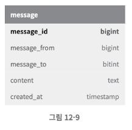
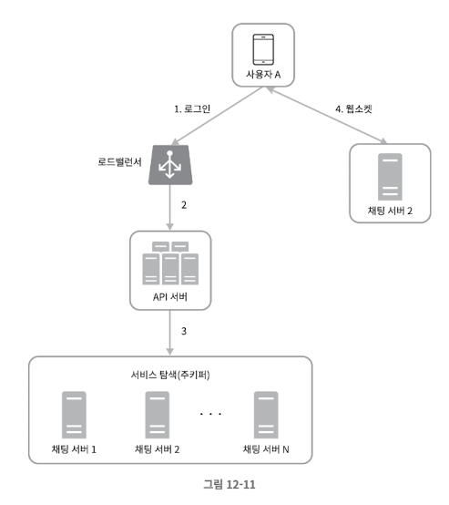

### 채팅 시스템 설계

### 문제 이해 및 설계 범위 확정
* 페이스북 메신저, 위챗, 왓츠앱처럼 1:1 채팅에 집중하는 앱들이 있는가 하면 슬랙 같은 그룹 채팅에 중점을 둔 업무용 앱이나, 게임 채팅에 쓰는 디스코드 같은 대규모 그룹의 소통과 응답지연이 낮은 음성 채팅에 집중하는 앱도 있다.
* 기능 요구 사항
  * 응답지연이 낮은 일대일 채팅 기능
  * 최대 100명까지 참여할 수 있는 그룹 채팅 기능
  * 사용자의 접속상태 표시 기능
  * 다양한 단말 지원. 하나의 계정으로 여러 단말에 동시 접속 지원
  * 푸시 알림

---

### 개략적 설계안 제시 및 동의 구하기
* 채팅 시스템의 경우 클라이언트는 모바일 앱이거나 웹 애플리케이션이다. 클라이언트는 서로 통신하지 않는다.

* **프로토콜**
  * 통신 클라이언트가 채팅 서비스에 메시지를 보낼 때 HTTP 프로토콜을 사용한다. 
  * 초기 페이스 북 메세지 앱의 송신 클라이언트는 서버에 HTTP 프로토콜을 이용해 수신 클라이언트에게 보낼 메세지를 정한다. 이 때 keep-alive 헤더를 사용하면 TCP 핸드쉐이크 횟수를 줄일 수 있다. 
  * HTTP는 클라이언트가 연결을 만드는 프로토콜이며, 서버에서 수신 클라이언트에 임의 시점에 메세지를 보낼 때는 사용하기 어렵기 때문에, 폴링, 롱 폴링, 웹소켓 등이 쓰이고 있다.
* **폴링**
  * 폴링은 수신 클라이언트가 서버에게 주기적으로 새 메세지가 있는지 물어보는 방법이다. 
  * 실제 주고 받는 글이 없음에도 불구하고 클라이언트에서 폴링이 없기 때문에 서버 자원이 불필요하게 낭비될 수 있다.

* **롱 폴링**
  * 클라이언트는 새 메시지가 반환되거나 타임아웃 될 때까지 연결을 유지한다.
  * 클라이언트는 새 메시지를 받으면 기존 연결을 종료하고 서버에 새로운 요청을 보내어 모든 절차를 다시 시작한다.
  * 메시지를 보내는 클라이언트와 수신하는 클라이언트가 같은 채팅 서버에 접속하게 되지 않을 수도 있다. HTTP 서버들은 보통 무상태 서버다. 로드 밸런싱을 위해 라운드 로빈을 사용하는 경우, 메시지를 받은 서버는 해당 메시지를 수신할 클라이언트와의 롱 폴링 연결을 가지고 있지 않은 서버일 수 있는 것이다.
  * 서버 입장에서는 클라이언트가 연결을 해제했는지 아닌지 알 좋은 방법이 없다.
  * 여전히 비효율적이다. 메시지를 많이 받지 않는 클라이언트도 타임아웃이 일어날 때마다 주기적으로 서버에 다시 접속할 것이다.

* **웹소켓**
  * 웹소켓은 서버가 클라이언트에게 비동기 메시지를 보낼 때 가장 널리 사용하는 기술이다.
  * 웹소켓 연결은 클라이언트가 시작한다. 한번 맺어진 연결은 항구적이며 양방향이다. 이 연결은 처음엔 HTTP 연결이지만 특정 핸드셰이크 절차를 거쳐 웹소켓 연결로 업그레이드 된다.
  * HTTP 프로토콜과 가장 다른 점은 양방향 통신이 가능하다는 것인데, 이 부분 떄문에 웹 소켓 대신 HTTP를 고집할 이유가 없다.

**개략적 설계안**
이 설계안에서는 클라이언트와 서버 사이의 주 통신 프로토콜로 웹소켓을 사용하기로 했지만, 다른 부분에서는 굳이 웹소켓을 쓸 필요는 없다. 사실 대부분의 기능은 일반적인 HTTP상에서 구현해도 된다.  
전체 시스템의 개략적 설계안의 경우 무상태 서비스, 상태유지 서비스, 제3자 서비스 연동의 세 부분으로 나눠서 볼 수 있다.

**무상태 서비스**  
* 로그인, 회원가입, 사용자 프로파일 표시 등을 처리하는 전통적인 요청/응답 서비스다.
* 무상태 서비스는 로드밸런서 뒤에 위치한다. 로드밸런서가 하는 일은 요청을 그 경로에 맞는 서비스로 정확하게 전달하는 것이다.

  

**상태 유지 서비스**
* 상태 유지가 필요한 서비스는 채팅 서비스다. 각 클라이언트가 채팅 서버와 독립적인 네트워크 연결을 유지해야 하기 때문이다.
* 클라이언트는 보통 서버가 살아 있는 한 다른 서버로 연결을 변경하지 않는다.

**제3자 서비스 연동**
* 채팅 앱에서 가장 중요한 제3자 서비스는 푸시 알림이다. 새 메시지를 받았다면 설사 앱이 실행 중이지 않더라도 알림을 받아야 해서다.

**규모 확장성**
* 트래픽 규모가 얼마 되지 않으면 모든 기능을 한 대의 서버로 구현할 수 있다.
* 현재 시스템의 경우 동시 접속자가 1M이고, 접속당 10K의 서버 메모리가 필요하다고 보면 10GB 메모리만 있으면 모든 연결을 다 처리할 수 있을 것이다.
* 하지만 SPOF문제로 한 대로 처리하지는 않는다.

  

* 채팅 서버는 클라이언트 사이에 메시지를 중계하는 역할을 담당한다.
* 접속상태 서버는 사용자의 접속 여부를 관리한다.
* API 서버는 로그인, 회원가입 등 그 외 나머지 전부를 처리한다.
* 알림 서버는 푸시 알림을 보낸다.
* 키-값 저장소는 채팅 이력을 보관한다. 시스템에 접속한 사용자는 이전 채팅 이력을 전부 보게 될 것이다.

**저장소**
* 채팅 시스템이 다루는 데이터는 보통 두 가지다.
  * 첫 번째는 사용자 프로파일, 설정, 친구 목록처럼 일반적인 데이터다. 이런 데이터는 RDB에 보관한다.
  * 두 번째는 채팅 시스템에 고유한 데이터로, 바로 채팅 이력이다. 이 데이터를 어떻게 보관할지 결정하려면 읽기/쓰기 연산 패턴을 이해해야 하는데 결론적으로 키-값 저장소를 추천한다.
    * 채팅 이력 데이터의 양은 엄청나다. 페이스북이나 왓츠앱은 매일 600억 개의 메시지를 처리한다.
    * 이 데이터 가운데 빈번하게 사용되는 것은 주로 최근에 주고받은 메시지다. 대부분의 사용자는 오래된 메시지는 들여다보지 않는다.
    * 사용자는 대체로 최근에 주고받은 메시지 데이터만 보게 되는 것이 사실이나, 검색 기능을 이용하거나, 특정 사용자가 언급된 메시지를 보거나, 특정 메시지로 점프하거나 하여 무작위적인 데이터 접근을 하게 되는 일도 있다.
    * 1:1 채팅 앱의 경우 읽기:쓰기 비율은 대략 1:1 정도다.

**키-값 저장소**
* 키-값 저장소는 수평적 규모확장이 쉽다.
* 데이터 접근 지연시간이 낮다.
* RDB는 데이터 가운에 롱 테일에 해당하는 부분을 잘 처리하지 못하는 경향이 있다. 인덱스가 커지면 데이터에 대한 무작위 접근을 처리하는 비용이 늘어난다.
* 이미 많은 안정적인 채팅 시스템이 키-값 저장소를 채택하고 있다. 페이스북 메신저나 디스코드가 그 사례다. 페이스북 메신저는 HBase를 사용하고 있고 디스코드는 카산드라를 이용하고 있다.

**데이터 모델**
* 1:1 채팅을 위한 메시지 테이블
  * 이 테이블의 기본 키(primary key)는 message_id로, 메시지 순서를 쉽게 정할 수 있도록 하는 역할도 담당한다. 두 메시지가 동시에 만들어질 수 있기 때문에 create_at을 사용하여 메시지 순서를 정할 수는 없다.

* 그룹 채팅을 위한 메시지 테이블
  * channel_id, message_id의 복합 키를 기본 키로 사용한다. channel_id는 파티션 키(partition key)로도 사용할 것인데, 그룹 채팅에 적용될 모든 질의는 특정 채널을 대상으로 할 것이기 때문이다.

**메시지 ID**
* message_id의 값은 고유해야 한다.
* message_id는 정렬 가능해야 하며 시간 순서와 일치해야 한다. 새로운 ID는 이전 ID보다 큰 값이어야 한다.  

RDBMS라면 auto_increment가 대안이 될 수 있겠지만, NoSQL은 보통 auto_increment를 제공하지 않기 때문에 스노플레이크 같은 전역적 64-bit 순서 번호(sequency number) 생성기를 이용한다. 또 다른 방법은 ID의 유일성은 같은 그룹 안에서만 보증하면 충분하기 떄문에 지역적 순서 번호 생성기 (local sequence number generator)를 사용한다.

---

### 상세 설계

**서비스 탐색**
* 서비스 탐색의 주된 역할은 클라이언트에게 가장 적합한 채팅 서버를 추천하는 것이다.
* 이때 사용되는 기준으로는 클라이언트의 위치, 서버의 용량 등이 있다.
* 널리 쓰이는 오픈 소스 솔루션으로는 아파치 주키퍼 같은 것이 있다. 사용 가능한 모든 채팅 서버를 여기 등록시키고, 클라이언트가 접속 시 사전에 정한 기준에 따라 골라주면 된다.

1. 사용자 A가 시스템에 로그인을 시도한다.
2. 로드밸런서가 로그인 요청을 API 서버들 가운데 하나로 보낸다.
3. API 서버가 사용자 인증을 처리하고 나면 서비스 탐색 기능이 동작하여 해당 사용자를 서비스할 최적의 채팅 서버를 찾는다.
4. 사용자 A는 찾은 채팅 서버와 웹소켓 연결을 맺는다.