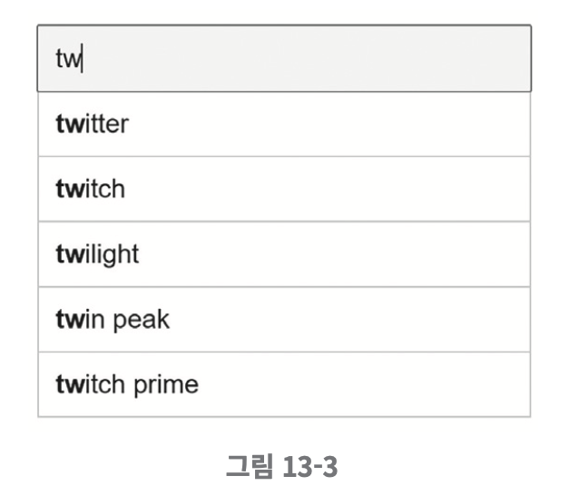

## 검색어 자동완성 시스템

### 문제 이해 및 설계 범위 확정
- 사용자가 입력하는 단어는 자동완성될 검색어의 첫 부분이다.
- 자동완성 검색어는 5개가 표시되어야 하고, 기준은 검색어 인기 순위다.
- 맞춤법 검사나 자동수정은 지원하지 않는다.
- 질의는 영어이고 가능하다면 다국어 지원을 해도 좋다.
- 모든 질의는 영어 소문자로 이루어진다.
- 일간 능동 사용자(DAU) 기준으로 천만명을 지원해야 한다.

**요구사항**
- 빠른 응답 속도: 사용자가 검색어를 입력함에 따라 자동완성 검색어도 충분히 빨리 표시되어야 한다. 페이스북 검색어 자동완성 시스템에 관한 문서를 보면 시스템 응답속도는 100밀리초 이내여야 한다.
- 연관성: 자동완성되어 출력되는 검색어는 사용자가 입력한 단어와 연관된 것이어야 한다.
- 정렬: 시스템의 계산 결과는 인기도 등의 순위 모델에 의해 정렬되어 있어야 한다.
- 규모 확장성: 시스템은 많은 트래픽을 감당할 수 있도록 확장 가능해야 한다.
- 고가용성: 시스템의 일부에 장애가 발생하거나, 느려지거나, 예상치 못한 네트워크 문제가 생겨도 시스템은 계속 사용가능해야 한다.

**개략적 규모 추정**
- 일간 능동 사용자(DAU)는 천만 명으로 가정한다.
- 평균적으로 한 사용자는 매일 10건의 검색을 수행한다고 가정한다.
- 질의할 때마다 평균적으로 20바이트의 데이터를 입력한다고 가정한다.
  - 문자 인코딩 방법으로는 ASCII를 사용한다고 가정할 것이므로, 1문자 = 1바이트이다.
  - 질의문은 평균적으로 4개 단어로 이루어진다고 가정할 것이며, 각 단어는 평균적으로 다섯 글자로 구성된다고 가정할 것이다.
  - 따라서 질의당 평균 4 * 5 = 20 바이트이다.
- 검색창에 글자를 입력할 때마다 클라이언트는 검색어 자동완성 백엔드에 요청을 보낸다. 따라서 평균적으로 1회 검색당 20건의 요청이 백엔드로 전달된다. 예를 들어 dinner라고 입력하면 6개의 요청이 순차적으로 백엔드에 전송된다
  - `search?q=d` `search?q=di` `search?q=din` `search?q=dinn` `search?q=dinne` `search?q=dinner`
- 대략 초당 24,000건의 질의(QPS)가 발생할 것이다.
- 최대 QPS = QPS * 2 = 대략 48,000
- 질의 가운데 20% 정도는 신규 검색어라고 가정할 것이다. 따라서 대략 0.4GB 정도다.

---

### 개략적 설계안 제시 및 동의 구하기
개략적으로 보면 시스템은 두 부분으로 나뉜다.  
- 데이터 수집 서비스: 사옹자가 입력한 질의를 실시간으로 수집하는 시스템이다. 데이터가 많은 애플리케이션에 실시간 시스템은 그다지 바람직하지 않지만 설계안을 만드는 출발점으로는 괜찮을 것이다.
- 질의 서비스: 주어진 질의에 다섯 개의 인기 검색어를 정렬해 내놓는 서비스이다.

**데이터 수집 서비스**  
질의문과 사용빈도를 저장하는 빈도 테이블이 있다고 가정하겠다. 처음에 이 테이블은 비어 있는데, 사용자가 `twitch`, `twitter`, `twit-ter`, `twillo`를 순서대로 검색하면 그 상태가 다음과 같이 바뀌어 나가게 된다.  

  

**질의 서비스**  
- query: 질의문을 저장하는 필드다.
- frequency: 질의문이 사용된 빈도를 저장하는 필드다.

    

이 상태에서 사용자가 "tw"를 검색창에 입력하면 아래의 "top 5" 자동완성 검색어가 표시되어야 한다.  

  

가장 많이 사용된 5개 검색어는 아래의 SQL 질의문을 사용해 계산할 수 있다.

```sql
SELECT * FROM frequency_table
WHERE query LIKE 'prefix%'
ORDER BY frequency DESC 
LIMIT 5
```

데이터 양이 적을 때는 나쁘지 않은 설계안이지만, 데이터가 많아지는 경우 데이터베이스가 병목이 될 수 있다.