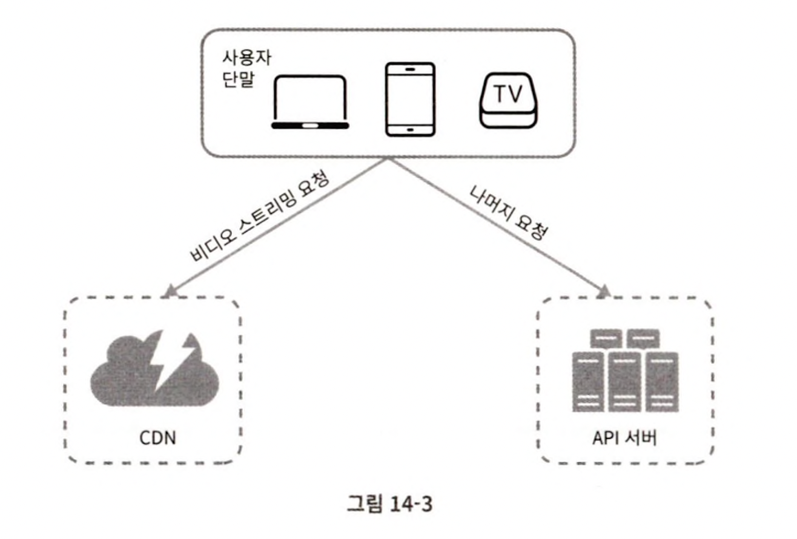
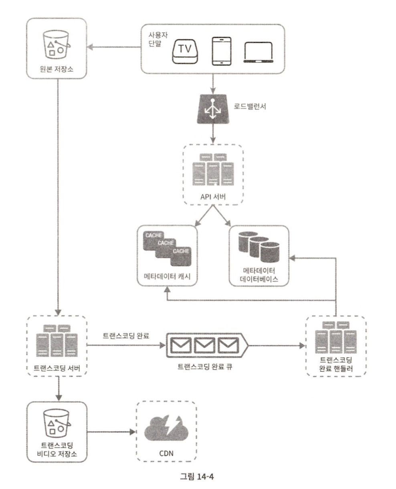

## 유튜브 설계

### 문제 이해 및 설계 범위 확정
- 비디오를 올리는 기능과 시청하는 기능이 가장 중요하다.
- 모바일 앱, 웹 브라우저, 스마트 TV를 지원해야 한다.
- 일간 능동 사용자 수는 5백만이다.
- 사용자의 평균 사용 시간은 30분이다.
- 다국어 지원이 필요하다.
- 현존하는 비디오 종류와 해상도를 대부분 지원해야 한다.
- 암호화가 필요하다.
- 비디오 크기는 최대 1GB로 제한한다.
- 아마존, 구글, 마이크로소프트가 제공하는 클라우드 서비스를 활용해도 된다.

**개략적 규모 추정**  
- DAU는 5백만
- 한 사용자는 하루에 평균 5개의 비디오를 시청
- 10%의 사용자가 하루에 1비디오 업로드
- 비디오 평균 크기는 300MB
- 비디오 저장을 위해 매일 새로 요구되는 저장 용량 = 5백만 * 10% * 300MB = 150TB
- CDN 비용
  - 클라우드 CDN을 통해 비디오를 서비스할 경우 데이터의 양에 따라 과금한다.
  - 아마존의 클라우드프론트를 사용할 경우, 100% 트래픽이 미국에서 발생한다고 가정하면 1GB당 $0.02의 요금이 발생한다.
  - 따라서 매일 발생하는 요금은 5백만 * 5비디오 * 0.3GB * $0.02 = $150,000이다.

---

### 개략적 설계안 제시 및 동의 구하기
앞서 기존 클라우드 서비스를 이용해도 좋다고 했는데, 직접 만들지 않은 이유는 다음과 같다.  

- 시스템 설계 면접은 모든 것을 밑바닥부터 만드는 것과는 관계가 없다. 주어진 시간 안에 적절한 기술을 골라 설계를 마치는 것이, 그 기술 각각이 어떻게 동작하는지 상세히 설명하는 것보다 중요하다. 예를 들어 비디오를 저장하기 위해 BLOB 저장소를 쓸 것이라면 그 사실만 언급해도 충분하다.
- 규모 확장이 쉬운 BLOB 저장소나 CDN을 만드는 것은 지극히 복잡할 뿐 아니라 많은 비용이 드는 일이다. 넷플릭스나 페이스북 같은 큰 회사도 모든 것을 스스로 구축하지는 않는다. 넷플릭스는 AWS의 클라우드 서비스를 이용하고 페이스북은 아카마이의 CDN을 이용한다.

개략적으로 보면 이 시스템은 다음의 세 개 컴포넌트로 구성된다.  

  

- 단말: 컴퓨터, 모바일 폰, 스마트 TV를 통해서 유튜브를 시청할 수 있다.
- CDN: 비디오는 CDN에 저장한다. 재생 버튼을 누르면 CDN으로부터 스트리밍이 이루어진다.
- API 서버: 비디오 스트리밍을 제외한 모든 요청은 API 서버가 처리한다. 피드 추천, 비디오 업로드 URL 생성, 메타데이터 데이터베이스와 캐시 갱신, 사용자 가입 등등이 API 서버가 처리하는 작업이다.

**비디오 업로드 절차**  
- 사용자: 유튜브를 시청하는 이용자다.
- 로드밸런서: API 서버 각각으로 고르게 요청을 분산하는 역할을 담당한다.
- API 서버: 비디오 스트리밍을 제외한 다른 모든 요청을 처리한다.
- 메타데이터 데이터베이스: 비디오의 메타데이터를 보관한다. 샤딩과 다중화를 적용해 성능 및 가용성 요구사항을 충족한다.
- 메타데이터 캐시: 성능을 높이기 위해 비디오 메타데이터와 사용자 객체는 캐시한다.
- 원본 저장소: 원본 비디오를 보관할 대형 이진 파일 저장소 시스템이다. BLOB 저장소는 "이진 데이터를 하나의 개체로 보관하는 데이터베이스 관리 시스템"이다.
- 트랜스코딩 서버: 비디오 트랜스코딩은 비디오 인코딩이라 부르기도 하는 절차로, 비디오의 포맷을 변환하는 절차다. 단말이나 대역폭 요구사항에 맞는 최적의 비디오 스트림을 제공하기 위해 필요하다.
- 트랜스코딩 비디오 저장소: 트랜스코딩이 완료된 비디오를 저장하는 BLOB 저장소다.
- CDN: 비디오를 캐시하는 역할을 담당한다.
- 트랜스코딩 완료 큐: 비디오 트랜스코딩 완료 이벤트들을 보관할 메시지 큐이다.
- 트랜스코딩 완료 핸들러: 트랜스코딩 완료 큐에서 이벤트 데이터를 꺼내어 메타데이터 캐시와 데이터베이스를 갱신할 작업 서버들이다.

  