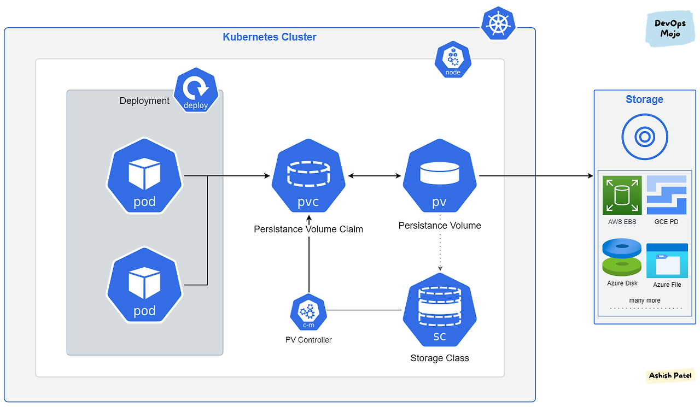

### PV, PVC 등장
영속성을 보장할 수 없는 파드에 데이터를 저장할 경우 언제든 데이터가 사라질 가능성 존재
따라서 파드의 생명주기와 무관하게 저장이 유지되는 데이터 저장소가 필요한데 이런 요구사항을 만족하기 위한 개념이 PV(PersistentVolume)와 PVC(PersistentVolumeClaim)

### PV
* 데이터를 저장할 볼륨. 볼륨을 생성하고 이를 클러스터에 등록한 것  

### PVC
* 필요한 저장 공간·RW모드 등 요청사항을 기술한 명세로서 PV에 전달하는 요청. PV와 바인딩을 하는 목적으로 사용

PV는 볼륨 자체로 클러스터 안에서 자원으로 다룬다. 파드와는 별개로 관리되며 별도의 생명 주기가 있다.  
PVC는 사용자가 PV에 하는 요청이다. 사용하고 싶은 용량은 얼마인지, 읽기/쓰기는 어떤 모드로 설정하고 싶은지 등을 정해 요청한다.  
쿠버네티스 볼륨을 파드에 직접 할당하는 방식이 아니라 중간에 PVC를 두어 파드와 파드가 사용할 스토리지를 분리했다.   

클라우드 서비스를 사용할 때는 본인이 사용하는 클라우드 서비스에서 제공해주는 볼륨 서비스를 사용할 수도 있고, 직접 구축한 스토리지를 사용할 수도 있다.
이렇게 다양한 스토리지를 PV로 사용할 수 있지만 파드에 직접 연결하는 것이 아니라 PVC를 거쳐서 사용하므로 파드는 어떤 스토리지를 사용하는지 신경 쓰지 않아도 된다.  

즉, PVC는 사용자가 스토리지를 요청하는 인터페이스 역할을 하고, PV는 실제 스토리지 리소스를 제공한다.