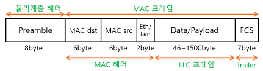

### 개발자, 네트워크 참조 모델에서 무엇을 알아야 할까

- 직무 별로 네트워크 참조 모델 지식을 구분하던 시절이 있었다.
    - 응용, 전송, 네트워크 계층: 개발자들이 알아야 하는 네트워크 지식
    - 네트워크, 데이터 링크, 물리 계층: 네트워크 엔지니어들이 알아야 하는 네트워크 지식
- 다만, 최근에는 이 구분이 모호해지고 있다.
- 왜? 인프라를 "코드"로 다루는 시대이기 때문 (IaC: Infrastructure as Code)
    - 개발자는 코드를 다룬다.
    - 코드로 인프라를 다룰 수 있다. -> 개발자도 인프라를 다룰 수 있다.

--- 

### 이더넷

**이더넷**

- 현대 LAN, 특히 유선 LAN 환경에서 가장 대중적으로 사용되는 기술
- 다양한 통신 매체의 규격, 송수신되는 프레임의 형태, 프레임의 형태, 프레임을 주고받는 방법 등이 정의된 기술
    - 물리 계층과 데이터 링크 계층이 밀접하게 연관된 이유

유선 LAN 환경은 대부분 이더넷을 기반으로 구성된다.

- 물리 계층에서는 사용되는 케이블? 이더넷 규격을 따름
- 데이터 링크 계층에서 주고받는 프레임? 이더넷 프레임의 형식을 따름

**국제 표준으로써의 이더넷**

- 이더넷은 IEEE 802.3이라는 이름으로 국제 표준이 됨
- IEEE 802.3 == 이더넷 관련 다양한 표준의 모음
- 이더넷 표준에 따라 지원되는 네트워크 장비, 통신 매체의 종류, 전송 속도 등이 달라짐
- "전송 속도BASE-추가 특성"이 표기 공식
    - ex) 1000BASE-SX, 5GBASE-T
    - 숫자만 표기되어 있으면 Mbps 속도
    - 숫자 뒤에 G가 붙는 경우 Gbps 속도
    - base는 베이스밴드의 약자로, 변조 타입을 의미
        - 변조 타입 - 비트 신호로 변환된 데이터를 통신 매체로 전송하는 방법 (개발과는 다소 거리가 있는 내용)

**추가 특성**

- 통신 매체의 특성을 명시
- 다양한 특성이 명시될 수 있음
    - 전송 가능한 최대 거리 - 예) 10BASE-2, 10BASE-5
    - 물리 계층 인코딩 방식 - 데이터가 비트 신호로 변환되는 방식
    - 레인 수 - 비트 신호를 옮길 수 있는 전송로 수
- 가장 중요한 추가 특성? -> **통신 매체의 종류**

**통신 매체의 종류**

| 구분 | 통신 매체의 종류             | 케이블 종류                                                   |
|----|-----------------------|----------------------------------------------------------|
| C  | 동축 케이블(Coaxial Cable) | 굵은 이더넷(ThickNet), 얇은 이더넷(ThinNet) 등                      |
| T  | 트위스티드 페어 케이블          | UTP(Unshielded Twisted Pair), STP(Shielded Twisted Pair) |
| S  | 단파장 광섬유 케이블           | Single-mode Fiber (Short wavelength)                     |
| L  | 장파장 광섬유 케이블           | Single-mode Fiber (Long wavelength)                      |

- 10BASE-T 케이블: 10Mbps 속도를 지원하는 트위스티드 페어 케이블 
- 1000BASE-SX 케이블: 1000Mbps 속도를 지원하는 단파장 광섬유 케이블 
- 1000BASE-LX 케이블: 1000Mbps 속도를 지원하는 장파장 광섬유 케이블

**이더넷은 지금도 발전 중**  
- 고속 이더넷 
  - 100Mbps가량의 속도를 지원하는 표준
- 기가비트 이더넷 
  - 1Gbps가량의 속도를 내는 이더넷 표준
- 10기가비트 이더넷 
  - 10Gbps가량의 속도를 내는 이더넷 표준

---

### 이더넷 프레임
- (데이터링크 계층) 이더넷 네트워크에서 주고받는 프레임 
  - 캡슐화를 거쳐 송신됨: 상위 계층 정보 + 헤더 + 트레일러 
  - 헤더 - 프리앰블, **수신지 MAC 주소**, **송신지 MAC 주소**, 타입/길이 
  - 페이로드 = 데이터 
  - 트레일러 - FCS
- 역캡슐화를 거쳐 수신됨
  - 헤더, 트레일러 제거 후 상위 계층으로 올려보냄

