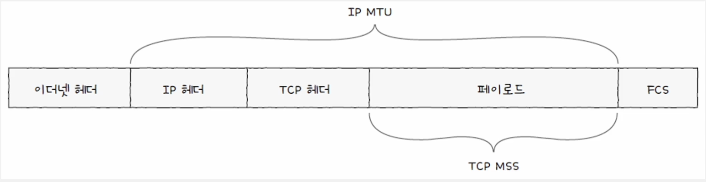
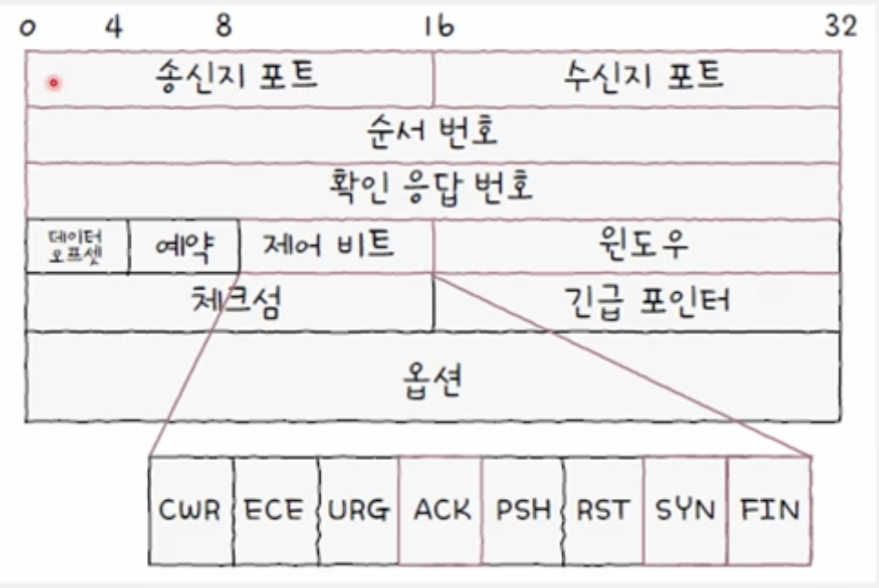
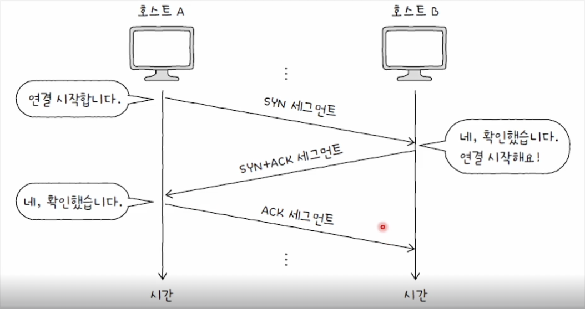
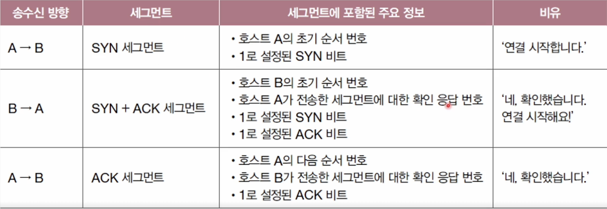
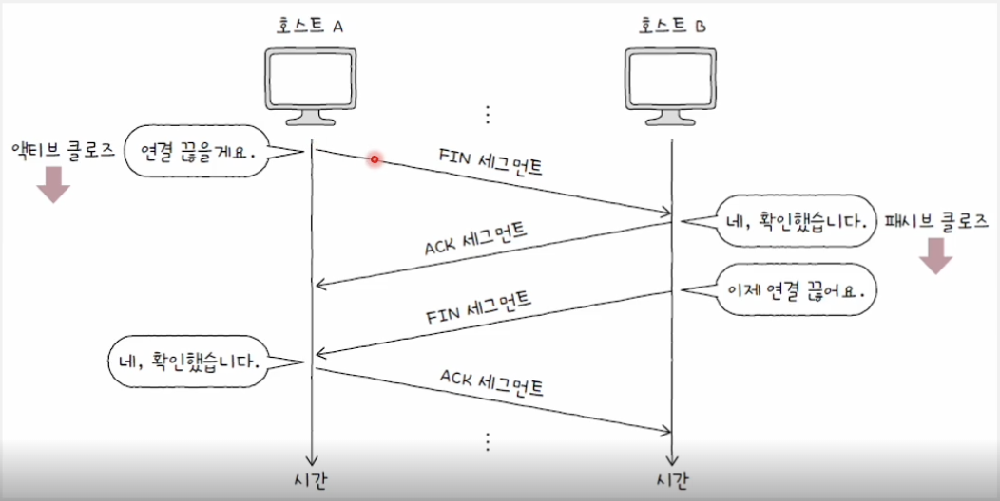
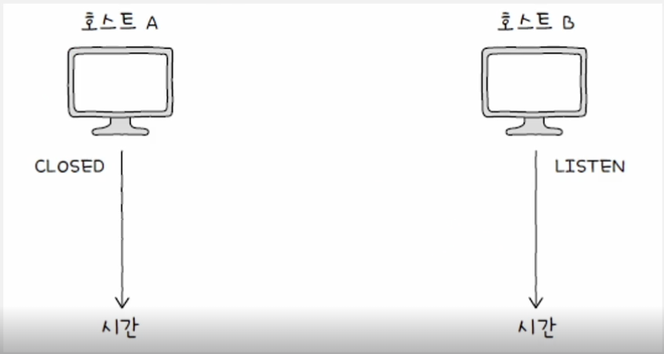
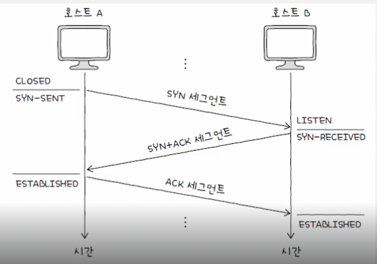
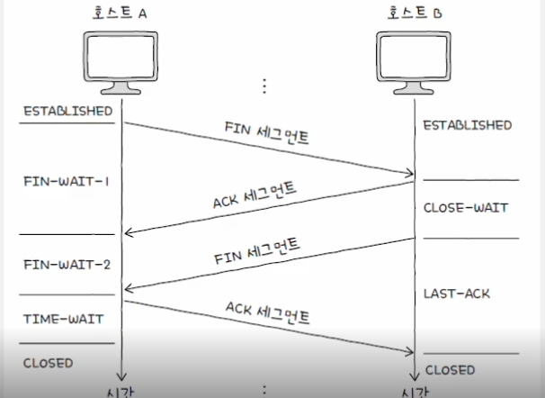

## 전송 계층

**전송 계층 개요**

- 네트워크 계층과 응용 계층 사이의 전송 계층
    - IP 한계 보완: 신뢰할 수 있는 통신과 연결형 통신 기능 제공
    - 응용 계층의 프로세스 식별: 포트 번호 활용

**IP 한계를 보완하는 전송 계층**

- 신뢰할 수 없는 통신과 비연결형 통신
- IP의 특징
    - 신뢰할 수 없는 (비신뢰성) 프로토콜
        - 패킷이 수신지까지 제대로 전송되었다는 보장을 하지 않음
        - 통신 과정에서 패킷이 잘못 전송되어도 이를 확인하지 않고, 재전송도 하지 않으며, 순서대로 패킷이 도착할 것이라는 보장도 하지 않는다는 의미
    - 비연결형 프로토콜
        - 송수신 호스트 간에 사전 연결 수립 작업을 거치지 않음
        - 그저 수신지를 향해 패킷을 보내기만 할 뿐
    - IP 패킷의 전달 = 신뢰성이 없는 통신 + 비연결형 통신

**IP는 왜 신뢰할 수 없는, 비연결형 통신을 할까?**

- 주된 이유는 성능으로, 신뢰할 수 있는 연결형 통신 = 성능에 악영향
- 신뢰성 있는 전송이 모든 경우에 필요한 것은 아님

**포트**

- 네트워크 상의 애플리케이션 식별 정보
- 패킷 내 수신지 포트와 송신지 포트를 통해 송수신지 호스트의 애플리케이션을 식별
- 16비트로 표현 가능 : 사용 가능한 포트의 수는 2의16승으로 65536개
    - 할당 가능한 포트 번호: 0번 ~ 65535번

**포트 번호 종류 및 범위**

| 포트 종류                     | 포트 번호 범위        | 설명                            |
|---------------------------|-----------------|-------------------------------|
| **Well-known ports**      | `0 ~ 1023`      | 운영체제나 표준 서비스에서 사용하는 포트        |
| **Registered ports**      | `1024 ~ 49151`  | 일반 애플리케이션에서 등록해서 사용하는 포트      |
| **Dynamic/Private ports** | `49152 ~ 65535` | 클라이언트에서 임시로 사용하는 포트 (에페머럴 포트) |

**예시**

| 포트 번호 | 서비스 예시          | 포트 종류             |
|-------|-----------------|-------------------|
| 22    | SSH             | Well-known        |
| 80    | HTTP            | Well-known        |
| 443   | HTTPS           | Well-known        |
| 3306  | MySQL           | Registered        |
| 8080  | Tomcat / WebApp | Registered        |
| 55000 | 클라이언트 임시 포트     | Dynamic / Private |

**포트를 활용하는 기술: 포트 기반 NAT**

- NAT 변환 테이블: 변환의 대상이 되는 IP 주소 쌍
- 사설 IP 주소 하나당 공인 IP 주소 하나가 대응: 많은 사설 IP 주소를 변환하기에는 무리가 있음
- 공인 IP 주소의 낭비: 사설 IP 주소의 수만큼 공인 IP 주소가 필요

**NAPT(Network Address Port Translation), APT**

- NAPT는 NAT 테이블에 변환할 IP 주소 쌍과 더불어 포트 번호도 함께 기록하고, 변환
- 하나의 공인 IP 주소를 여러 사설 IP 주소가 공유 가능
    - 사설 IP 주소: 공인 IP 주소를 N:1로 변환
    - 공인 IP 주소 수 부족 문제를 개선한 기술

**포트 포워딩**

- 네트워크 내부의 여러 호스트가 공인 IP 주소를 공유하는 상황
- 네트워크 외부에서 내부로 (원격 접속을 시도하는 등) 통신을 시작하는 상황
- 위 상황에서 네트워크 내 특정 호스트에 IP 주소와 포트 번호를 미리 할당하고, 해당 IP 주소:포트 번호로써 해당 호스트에게 패킷을 전달하는 기능

**IP의 전송 특성을 보완하는 ICMP**

- IP 패킷 전송 과정에 대한 피드백 메시지 제공
- 피드백 메시지
    - 전송 과정에서 발생한 문제 상황에 대한 오류 보고
    - 네트워크에 대한 진단 정보(네트워크상의 정보 제공)
- RFC 792에 따르면 ICMP는 IP의 보조일 뿐: 신뢰성의 완전 보장 X

**ICMP 메시지 타입(Type) + 코드(Code)**  

| 타입(Type) | 의미                      | 코드(Code) | 코드 의미                             |
|----------|-------------------------|----------|-----------------------------------|
| 0        | Echo Reply (응답)         | 0        | 응답                                |
| 3        | Destination Unreachable | 0        | Network Unreachable               |
|          |                         | 1        | Host Unreachable                  |
|          |                         | 2        | Protocol Unreachable              |
|          |                         | 3        | Port Unreachable                  |
|          |                         | 6        | Network Unknown                   |
|          |                         | 7        | Host Unknown                      |
| 5        | Redirect Message        | 0        | Redirect for Network              |
|          |                         | 1        | Redirect for Host                 |
| 8        | Echo Request (핑 요청)     | 0        | 요청                                |
| 9        | Router Advertisement    | 0        | 라우터 광고                            |
| 10       | Router Solicitation     | 0        | 라우터 요청                            |
| 11       | Time Exceeded           | 0        | TTL exceeded in transit           |
|          |                         | 1        | Fragment reassembly time exceeded |
| 12       | Parameter Problem       | 0        | Pointer indicates the error       |
| 13       | Timestamp Request       | 0        | 타임스탬프 요청                          |
| 14       | Timestamp Reply         | 0        | 타임스탬프 응답                          |

---

### TCP와 UDP

**TCP**

- 연결형 통신을 가능하게 함
    - 송수신하는 동안에는 연결을 유지하고, 송수신이 끝나면 연결을 종료
- 신뢰성 있는 통신을 가능하게 함
    - 재전송을 통한 오류 제어, 흐름 제어, 혼잡 제어 등 다양한 기능들을 제공

**UDP**

- 신뢰할 수 없는 통신, 비연결형 통신을 가능하게 함
- TCP보다는 비교적 빠른 전송이 가능

**MSS(Maximum Segment Size) 단위**    
- MSS - TCP로 전송할 수 있는 최대 페이로드 크기 
- TCP 헤더 크기는 제외

--- 

### TCP 세그먼트 구조  

- **순서 번호**   
  - 순서 번호가 명시되는 필드 
  - 순서 번호 
    - 송수신되는 세그먼트 데이터의 첫 바이트에 부여되는 번호 
    - 세그먼트의 올바른 송수신 순서를 보장하기 위한 번호
    - 순서 번호 = 초기 순서 번호 + 송신한 바이트 수 (초기 순서 번호는 무작위 값)
- **확인 응답 번호**
  - 상대 호스트가 보낸 세그먼트에 대한 응답 
  - 다음으로 수신하기를 기대하는 순서 번호가 명시
  - 수신자가 다음으로 받기를 기대하는 순서 번호(일반적으로 '수신한 순서 번호 + 1')
  - 확인 응답 번호 값을 보내기 위해서는 제어 비트에서 승인을 나타내는 비트인 ACK 플래그를 1로 설정
- **제어 비트 또는 플래그 비트**
  - 현재 세그먼트에 대한 부가 정보 
  - 기본적으로 8비트로 구성 
    - ACK: 세그먼트의 승인을 나타내기 위한 비트 
    - SYN: 연결을 수립하기 위한 비트 
    - FIN: 연결을 종료하기 위한 비트
- **윈도우**
  - 수신 윈도우(한 번에 수신하고자 하는 데이터의 양)의 크기가 명시

---

### TCP 연결 수립과 종료  

**연결 수립**  

- 액티브 오픈: 연결 시작 호스트의 연결 수립 과정 
- 패시브 오픈: 연결 수락 호스트의 연결 수립 과정

**연결 종료**
- 송수신 호스트가 각자 한 번 씩 FIN, ACK를 주고 받으며 TCP가 종료 
  - 액티브 클로즈: 종료 시작 호스트의 종료 과정 
  - 패시브 클로즈: 종료 수락 호스트의 종료 과정

**TCP 상태의 유형**  
- **연결이 수립되지 않은 상태**
  - CLOSED - 아무런 연결이 없는 상태 
  - LISTEN - 일종의 연결 대기 상태 (SYN 세그먼트를 기다리는 상태)
    - 서버로서 동작하는 패시브 오픈 호스트는 일반적으로 LISTEN 상태 유지 
    - LISTEN 호스트에게 SYN 세그먼트를 보내면 쓰리 웨이 핸드셰이크 시작

- **연결 수립 과정에서 주로 볼 수 있는 상태**
  - **STN-SENT**
    - 연결 요청을 보낸 뒤 대기하는 상태 
    - 액티브 오픈 호스트가 SYN 세그먼트를 보낸 뒤 그에 대한 응답인 SYN + ACK 세그먼트를 기다리는 상태
  - **SYN-RECEIVED**
    - 패시브 오픈 호스트가 SYN + ACK 세그먼트를 보낸 뒤 그에 대한 ACK 세그먼트를 기다리는 상태
  - **ESTABLISHED**
    - 연결이 확립되었음을 나타내는 상태

- **연결 종료 과정에서 주로 볼 수 있는 상태**
  - **FIN_WAIT-1**
    - 일반적인 TCP 연결 종료 과정에 있어 FIN-WAIT-1은 연결 종료의 첫 단계
  - **CLOSE-WAIT**
    - 종료 요청인 FIN 세그먼트를 받은 패시브 클로즈 호스트가 그에 대한 응답으로 ACK 세그먼트를 보낸 후 대기하는 상태
  - **FIN-WAIT-2**
    - FIN-WAIT-1 상태에서 ACK 세그먼트를 받고 상대 호스트의 FIN 세그먼트를 기다리는 상태
  - **LAST-ACK**
    - CLOSE-WAIT 상태에서 FIN 세그먼트를 전송한 뒤 이에 대한 ACK 세그먼트를 기다리는 상태
  - **TIME-WAIT**
    - 액티브 클로즈 호스트가 FIN 세그먼트를 수신한 뒤, 이에 대한 ACK 세그먼트를 전송한 뒤 접어드는 상태 
    - 패시브 클로즈 호스트는 마지막 ACK 세그먼트를 수신하면 CLOSED 상태로 전이 
    - TIME-WAIT 상태의 액티브 클로즈 호스트는 일정 시간을 기다린 뒤 CLOSED 상태로 전이

