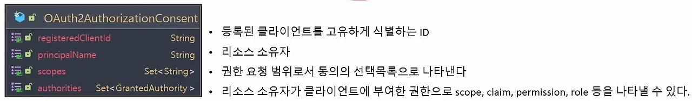

- `OAuth2AuthorizationConsent` 는 OAuth2 권한 부여 요청 흐름의 권한 부여 "동의" (결정)를 나타낸다.
- 클라이언트에 대한 액세스를 승인할 때 리소스 소유자는 클라이언트가 요청한 권한의 하위 집합만 허용할 수 있다.
- 클라이언트가 범위를 요청하고 리소스 소유자가 요청된 범위에 대한 엑세스를 허용하거나 거부하는 `authorization_code grant` 흐름이다.
- OAuth2 인증 흐름이 완료되면 `OAuth2 Authorization Consent`가 생성(또는 업데이트) 되고 부여된 권한을 클라이언트 및 리소스 소유자와 연결한다.

**OAuth2AuthorizationConsentService**

OAuth2AuthorizationConsent가 저장이 되고 조회 가능하다.

InMemory, JDBC 버전의 구현체가 존재한다.

1. form 로그인 방식으로 인증을 시도하고 있기 때문에 `UsernamePasswordAuthenticationFilter`에서 처리한다.
2. 인증에 성공하게 되면 `SuccessHandler`에서 사진의 url로 `sendRedirect`를 하게 된다.
3. 그러면 위의 `OAuth2AuthorizationEndpointFilter`에서 인증을 받고  `Authenticated?`에서 이번엔 form 로그인 방식으로 인증을 했으므로 `yes`로 빠지게 된다.
    1. open id의 scope는 `ConsentPage`에 따로 나오지 않는다. (저절로 포함됨) 인증 프로토콜이기 때문이다.
4. `OAuth2AuthorizationRequest`엔 쿼리 파라미터 값들이 저장 되어 있고, `Consent required` 동의하기 필수 설정 `true`면 동의 하기 페이지로 넘어가고 `false`면 넘어가지 않는다.
5. `AuthorizationCodeRequestAuthenticationToken` 에서 `consentRequired` 값을 `true`로 설정
6. 스코프 정보를 권한 부여 처리하고, 스코프를 기반으로 동의하기 페이지 생성

1. `POST` 방식으로 다시 `EndpointFilter` 과정을 거침
2. 최초 전달한 스코프와 사용자가 선택한 스코프를 비교해서 포함 되어 있는지 체크
3. 스코프 선택 여부 체크
4. `code` 생성 하고 `OAuth2AuthorizaitonCodeRequestAuthenticationToken`에서 `code`, `state`, `redirectUrl`를 담아 토큰 생성 후 반환

**궁금점 / 해결**

1. 왜 `containsAll`이 있음에도 `isEmpty` 로 또 스코프 값 검증하는 이유?

→  `containsAll` 은 사용자가 동의한 scope가 없더라도 통과해서 `isEmpty`로 검증

2. 유저 A, B가 있고 유저 A가 동의 화면 `read`를 체크하고 요청했을 때 유저 A가 보냈는지 B가 보냈는지 구분법?

1. 사용자가 로그인을 시도한다.
2. 서버에서 쓰레드를 생성한다.
    - 각 쓰레드마다 ThreadLocal이 생성된다.
3. 쓰레드가 인증 처리를 수행한다.
4. 만약 인증이 실패하면 SecurityContextHolder.clearContext()를 호출해 SecurrityContextHolder 내 SecurityContext 정보를 초기화 한다.
5. 만약 인증에 성공하면 인증 필터는 SecurityContextHolder 내 SecurityHolder 객체에 인증에 성공한 Auhtentication 객체를 담는다.
6. 최종적으로 SecurityContext는 HttpSession에 저장된다.

**즉 ThreadLocal을 사용해 현재 요청 스레드와 연결되어 있는 유저에 접근**