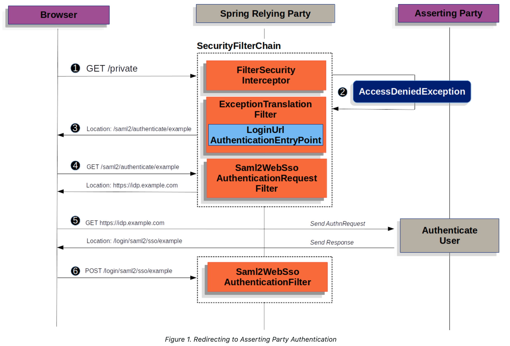

**GET /private**  
사용자가 브라우저에서 보호된 리소스에 접근하기 위해 GET 요청을 보냅니다.  

**AccessDeniedException 발생**  
해당 리소스는 인증된 사용자만 접근 가능하기 때문에, AccessDeniedException이 발생합니다. 이때 LoginUrlAuthenticationEntryPoint가 활성화됩니다.  

**Location 리디렉션: /saml2/authenticate/example**  
브라우저는 /saml2/authenticate/example URL로 리디렉션됩니다.  

**GET /saml2/authenticate/example**  
브라우저가 리디렉션된 후 /saml2/authenticate/example에 GET 요청을 보내고, 이는 IDP(Idenitity Provider, 인증 제공자)로 리디렉션됩니다.  

**IDP로 리디렉션 및 AuthnRequest 전송**  
브라우저는 IDP (https://idp.example.com)로 GET 요청을 보내고, 이 과정에서 AuthnRequest가 IDP에 전송됩니다.  

**POST /login/saml2/sso/example**  
IDP가 사용자 인증을 완료한 후, 응답을 SP(Service Provider)에 전달하기 위해 브라우저는 /login/saml2/sso/example로 POST 요청을 보냅니다.

- - -
# **한 번도 로그인하지 않은 경우**

1)**사용자가 SP를 사용하기 위해 접근**한다.

2)**SP에 해당 사용자의 세션(정보) 이 저장되어있는지 체크**한다.

3)**SP에 세션이 저장되어 있지 않아**,**IdP로 Redirect**한다. (SSO 인증 모듈로 이동)

4)**IdP에도 세션이 저장되어 있지 않아**, 로그인(또는 인증) 페이지를 통해**사용자가 로그인**하도록 한다.

5)로그인에 성공하면,**IdP에 해당 사용자의 세션(정보)를 저장**한 후**SP로 Redirect**한다. (페이지 이동)

6)**SP에도 세션을 저장**한 후(로그인 성공 전달)**사용자가 SP를 사용할 수 있도록**한다.

# **기존에 한 번 이상 로그인한 경우**

1)사용자가 SP를 사용하기 위해 접근한다.

2)SP에 해당 사용자의 세션(정보) 이 저장되어있는지 체크한다.

3)SP에 세션이 저장되어 있지 않아,**IdP로 Redirect**한다. (SSO 인증 모듈로 이동)

*3 - 1)SP에 세션이 저장되어 있는 경우 세션에 맞게 사용자가 SP를 사용할 수 있도록 한다.*

4)**IdP에 세션이 저장되어 있어,****해당 세션을 가지고****SP로 Redirect**한다. (페이지 이동)

5)**SP에 IdP에서 가져온 세션을 저장한 후**(로그인 성공 전달)**사용자가 SP를 사용할 수 있도록**한다.