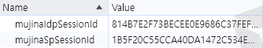

## Idp
### SAML Request 처리, SAML Response 생성
* SAMLMessageHandler 클래스

`SAML Request 추출 & 검증`
```java
public SAMLMessageContext extractSAMLMessageContext(HttpServletRequest request, HttpServletResponse response, boolean postRequest) throws ValidationException, SecurityException, MessageDecodingException, MetadataProviderException {
    SAMLMessageContext messageContext = new SAMLMessageContext();

    proxiedSAMLContextProviderLB.populateGenericContext(request, response, messageContext);

    messageContext.setSecurityPolicyResolver(resolver);

    SAMLMessageDecoder samlMessageDecoder = samlMessageDecoder(postRequest);
    samlMessageDecoder.decode(messageContext);

    SAMLObject inboundSAMLMessage = messageContext.getInboundSAMLMessage();

    AuthnRequest authnRequest = (AuthnRequest) inboundSAMLMessage;
    //lambda is poor with Exceptions
    for (ValidatorSuite validatorSuite : validatorSuites) {
        validatorSuite.validate(authnRequest);
     }
    return messageContext;
}
```

`SAML Response 생성 & 전송`
```java
public void sendAuthnResponse(SAMLPrincipal principal,
                                  String authnContextClassRefValue,
                                  HttpServletResponse response) throws MarshallingException, SignatureException, MessageEncodingException {
    Status status = buildStatus(StatusCode.SUCCESS_URI);

    String entityId = idpConfiguration.getEntityId();
    Credential signingCredential = resolveCredential(entityId);

    Response authResponse = buildSAMLObject(Response.class, Response.DEFAULT_ELEMENT_NAME);
    Issuer issuer = buildIssuer(entityId);

    authResponse.setIssuer(issuer);
    authResponse.setID(SAMLBuilder.randomSAMLId());
    authResponse.setIssueInstant(new DateTime());
    authResponse.setInResponseTo(principal.getRequestID());

    Assertion assertion = buildAssertion(principal, authnContextClassRefValue, status, entityId);
    signAssertion(assertion, signingCredential);

    authResponse.getAssertions().add(assertion);
    authResponse.setDestination(principal.getAssertionConsumerServiceURL());

    authResponse.setStatus(status);

    Endpoint endpoint = buildSAMLObject(Endpoint.class, SingleSignOnService.DEFAULT_ELEMENT_NAME);
    endpoint.setLocation(principal.getAssertionConsumerServiceURL());

    HttpServletResponseAdapter outTransport = new HttpServletResponseAdapter(response, false);

    BasicSAMLMessageContext messageContext = new BasicSAMLMessageContext();

    messageContext.setOutboundMessageTransport(outTransport);
    messageContext.setPeerEntityEndpoint(endpoint);
    messageContext.setOutboundSAMLMessage(authResponse);
    messageContext.setOutboundSAMLMessageSigningCredential(signingCredential);

    messageContext.setOutboundMessageIssuer(entityId);
    messageContext.setRelayState(principal.getRelayState());
    encoder.encode(messageContext);
}
```

### 인증 정보 초기화 
* ForceAuthnFilter 클래스

  



```java

@Override
protected void doFilterInternal(HttpServletRequest request, HttpServletResponse response, FilterChain chain) {
    ...
    AuthnRequest authnRequest = (AuthnRequest) messageContext.getInboundSAMLMessage();
    if (authnRequest.isForceAuthn()) {
        SecurityContextHolder.getContext().setAuthentication(null);
    }
    chain.doFilter(request, response);
}
```
- **`forceAuthn = true`**
    - 사용자가 **IdP에서 인증된 세션**을 가지고 있어도, SAML 요청이 들어올 때마다 **무조건 재인증**을 요구한다.
    - 사용자가 **세션을 변경하거나** 브라우저를 새로 열거나 다른 세션에서 액세스할 때, 무조건 **다시 로그인**을 해야한다.
- **`forceAuthn = false`**
    - 사용자가 이미 **인증된 세션**이 있는 경우, SAML 요청이 들어와도 **기존 세션을 유지**하며, **재로그인을 요구하지 않는다**.
    - 세션이 변경되더라도, 사용자가 **여전히 유효한 세션을 보유하고 있다면** 재인증 없이 계속 인증된 상태로 유지된다.

- - -
## SP  
### IdP의 MetadataUrl 등록
* WebSecurityConfigurer 클래스
* xml 파일 경로를 등록 `classpath:metadata/mujina.local.idp.metadata.xml`

```java
@Value("${sp.idp_metadata_url}")
private String identityProviderMetadataUrl;

@Bean
public MetadataProvider identityProvider() {
    Resource resource = defaultResourceLoader.getResource(identityProviderMetadataUrl);
    ResourceMetadataProvider resourceMetadataProvider = new ResourceMetadataProvider(resource);
    resourceMetadataProvider.setParserPool(parserPool());
    ExtendedMetadataDelegate extendedMetadataDelegate = new ExtendedMetadataDelegate(resourceMetadataProvider, extendedMetadata());
    extendedMetadataDelegate.setMetadataTrustCheck(true);
    extendedMetadataDelegate.setMetadataRequireSignature(true);
    return extendedMetadataDelegate;
}
```

### SP -> IdP SAML Request 전송
* SAMLProcessorImpl 클래스
  * Mujina에서는 `ConfigurableSAMLProcessor`로 커스텀

```java
@Override
public SAMLMessageContext sendMessage(SAMLMessageContext samlContext, boolean sign) {
    Endpoint endpoint = samlContext.getPeerEntityEndpoint();

    SAMLBinding binding = getBinding(endpoint);

    samlContext.setLocalEntityId(spConfiguration.getEntityId());
    samlContext.getLocalEntityMetadata().setEntityID(spConfiguration.getEntityId());
    samlContext.getPeerEntityEndpoint().setLocation(spConfiguration.getIdpSSOServiceURL());

    SPSSODescriptor roleDescriptor = (SPSSODescriptor) samlContext.getLocalEntityMetadata().getRoleDescriptors().get(0);
    AssertionConsumerService assertionConsumerService = roleDescriptor.getAssertionConsumerServices().stream().filter(service -> service.isDefault()).findAny().orElseThrow(() -> new RuntimeException("No default ACS"));
    assertionConsumerService.setBinding(spConfiguration.getProtocolBinding());
    assertionConsumerService.setLocation(spConfiguration.getAssertionConsumerServiceURL());

    return super.sendMessage(samlContext, spConfiguration.isNeedsSigning(), binding);
}
```

### SAML Response 검증 
* WebSSOProfileConsumerImpl 클래스  
```java
public SAMLCredential processAuthenticationResponse(SAMLMessageContext context) {
    AuthnRequest request = null;
    SAMLObject message = context.getInboundSAMLMessage();
    if (!(message instanceof Response)) {
        throw new SAMLException("Message is not of a Response object type");
    } else {
        Response response = (Response) message;
        StatusCode statusCode = response.getStatus().getStatusCode();
        if (!"urn:oasis:names:tc:SAML:2.0:status:Success".equals(statusCode.getValue())) {
            StatusMessage statusMessage = response.getStatus().getStatusMessage();
            String statusMessageText = null;
            if (statusMessage != null) {
                statusMessageText = statusMessage.getMessage();
            }
        }
    }
    ...
}
```
